# 🖥️ DHCP Server Setup with AD Integration + Failover 💡

This project showcases how I set up a **DHCP server** integrated with **Active Directory**, and also implemented a **failover configuration** using **load balancing** between two Windows Servers in my test lab. I documented every step I took from start to finish 🛠️.

---

## 🧩 Project Overview

- 🧑🏽‍💻 **Primary DHCP Server**: `TESTDC-01` (AD + DHCP)
- 🧑🏽‍💻 **Failover DHCP Server**: `TESTDC-03` (Joined to AD)
- 🧪 **Client**: `CLIENT-02` (Windows 10)
- ⚙️ **Failover Mode**: Load Balancing
- 🌐 **Domain Name**: `Manueltech.com`
- 🐱‍💻Virtualization: Vmware and VirtualBox

---

## 🚶🏽‍♂️ My Step-by-Step Setup Process

### ✅ Step 1: Installed DHCP Role on `TESTDC-01`

1. Opened **Server Manager** > `Add Roles and Features`.
2. Selected **DHCP Server** and completed the installation.
3. Authorized the server in Active Directory.
4. Confirmed it under DHCP console with no red X ❌.
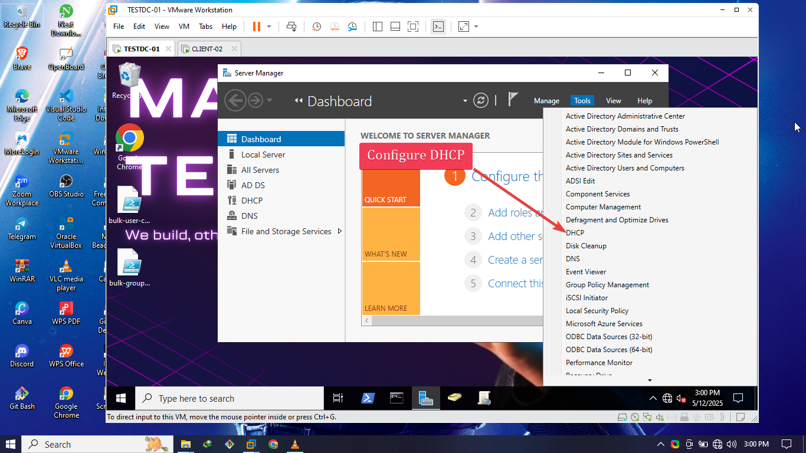
---

### 📦 Step 2: Configured a New IPv4 Scope

1. Launched DHCP Manager → Right-clicked `IPv4` > `New Scope`.
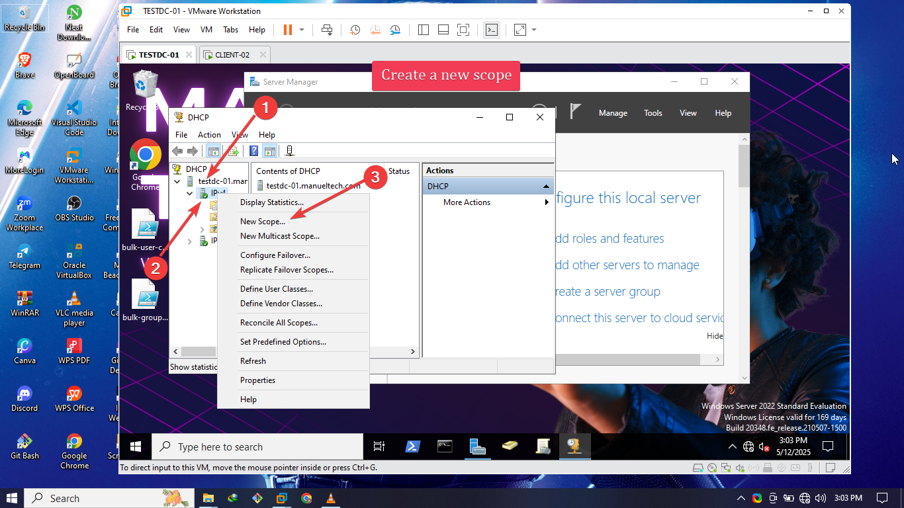
2. Named it `ManuelTech DHCP server`.
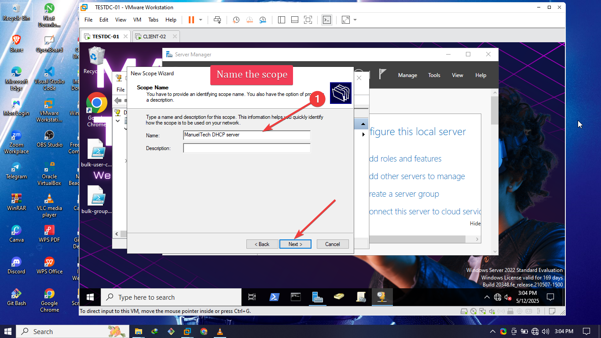
3. Set range: `192.168.255.1` to `192.168.255.200`.
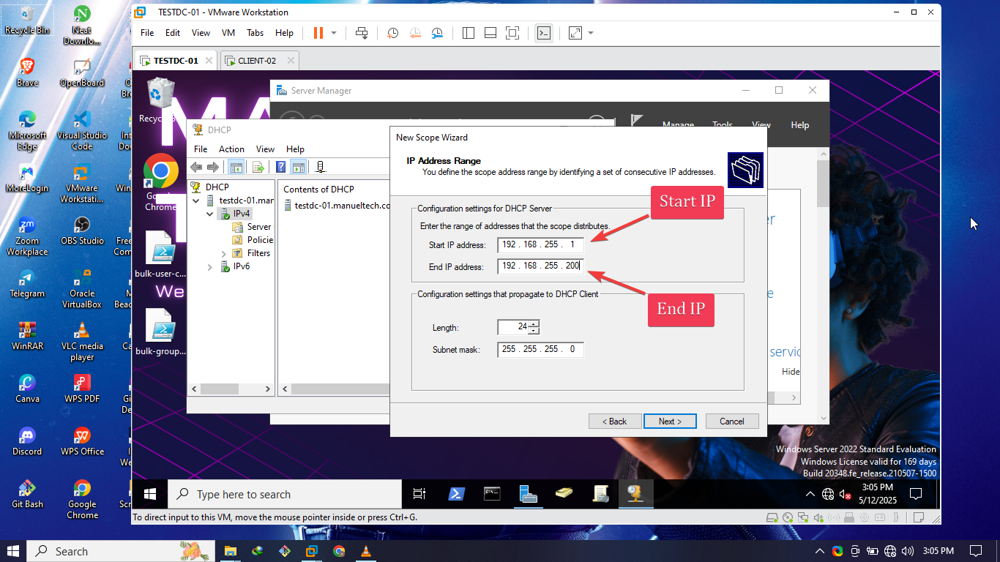
4. Excluded a few reserved IP for server.
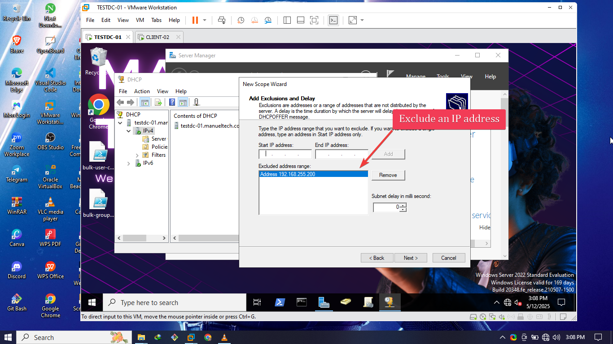
5. Left the lease duration as 8 days (default duration)
5. Configured:
   - Default Gateway: `192.168.255.1`
    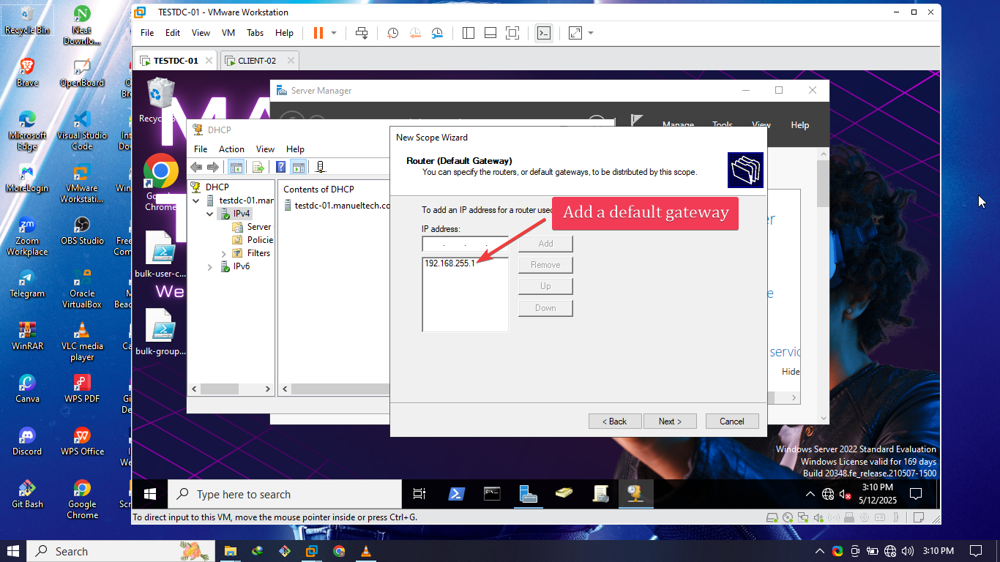
   - DNS: `192.168.255.210` (my DC/DNS server)
   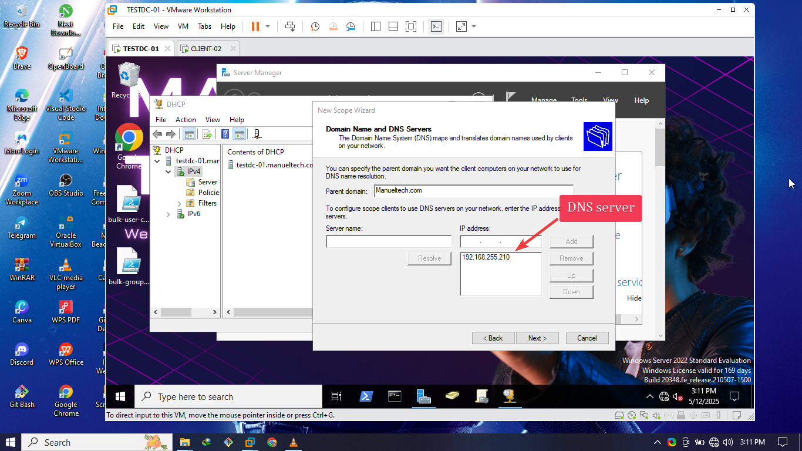
6. Activated the scope 🎯.
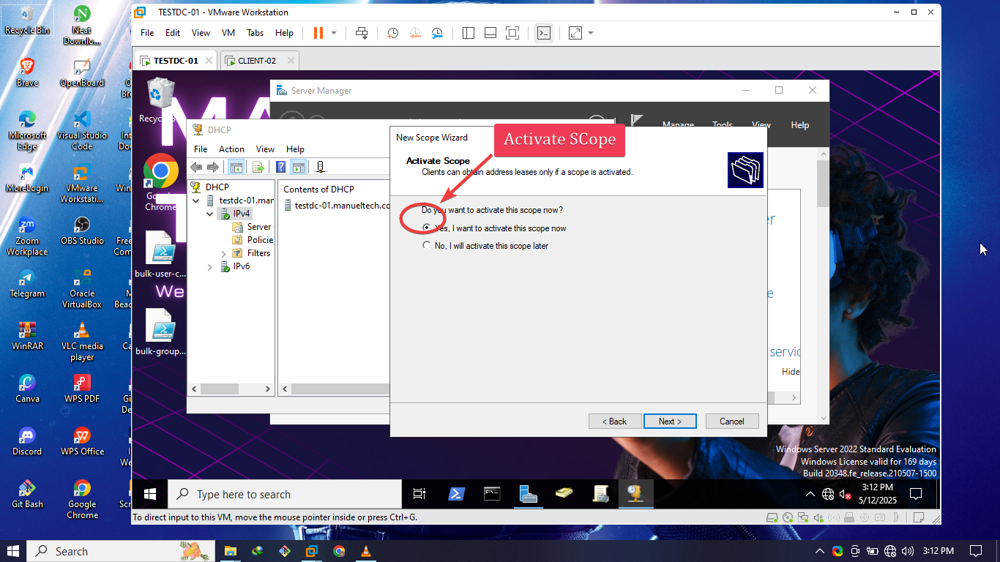

---

### 💻 Step 3: Tested DHCP on `CLIENT-02`

1. Booted up Windows 10 client `CLIENT-02`.
2. Connected it to the domain network.
3. Ran `ipconfig /renew` from command prompt.
4. Voila! 🎉 It pulled an IP from the DHCP scope.
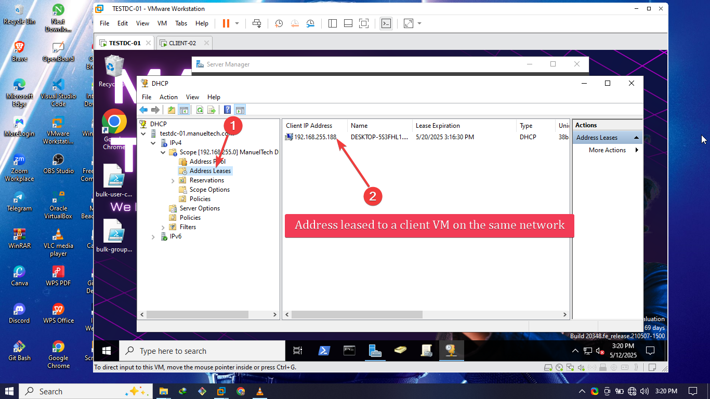
5. Verified DNS and gateway were also assigned correctly ✅.

---

### 🔁 Step 4: Joined `TESTDC-03` to the Domain

1. Installed Windows Server on `TESTDC-03`.
2. Joined it to the domain `emmanuel.lab`.
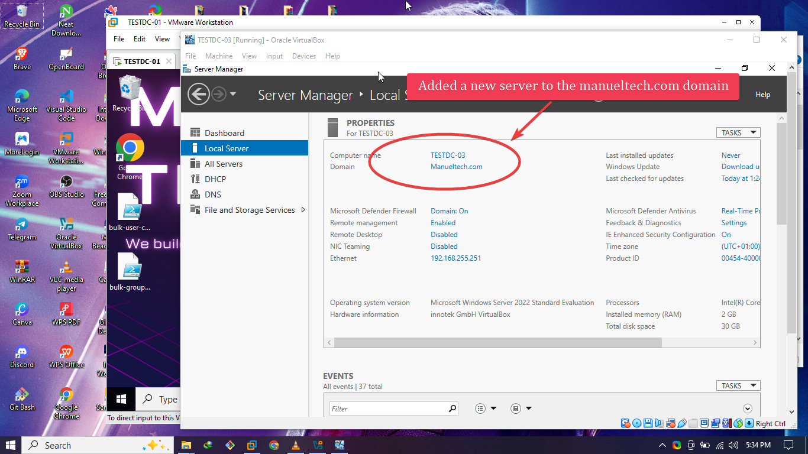
3. Remotely Installed the **DHCP Server role** using powershell on the TESTDC-01 server.
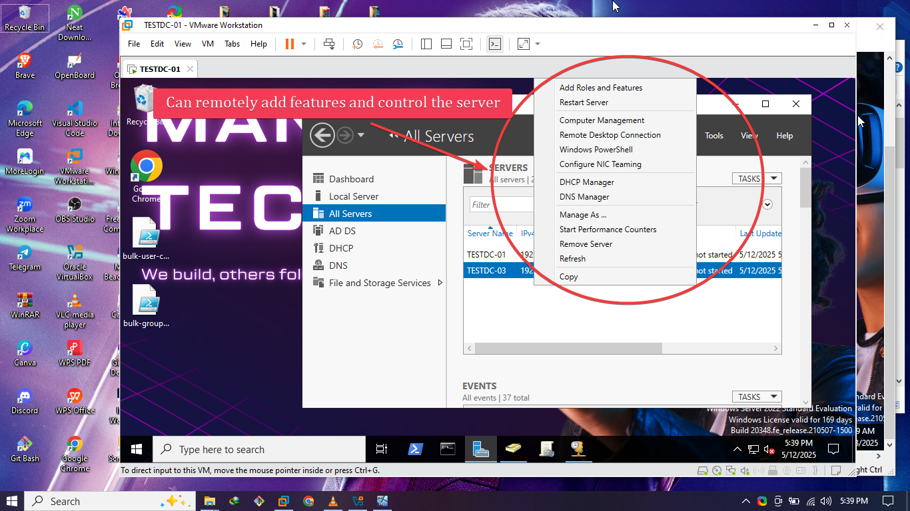
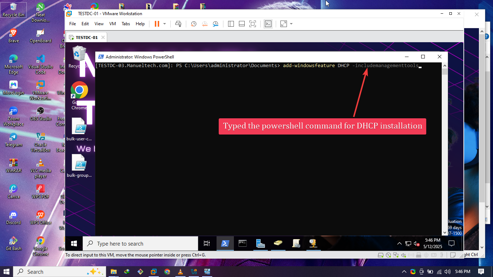
4. Authorized it in Active Directory.
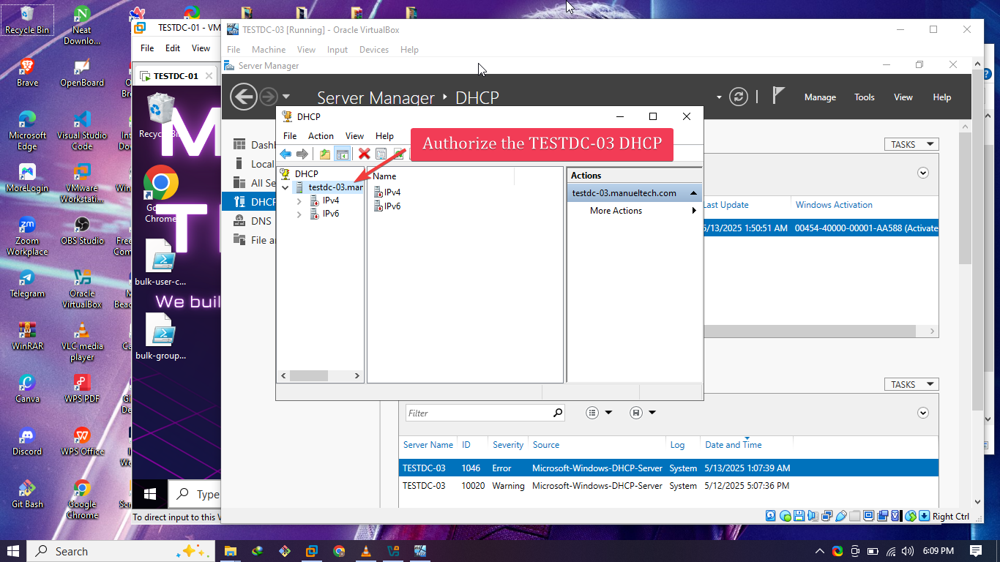

---

### 🤝 Step 5: Configured DHCP Failover (Load Balancing)

1. On `TESTDC-01`, opened DHCP Manager.
2. Right-clicked the scope > `Configure Failover`.
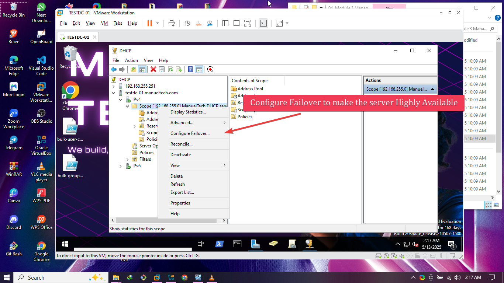
3. Add partner server
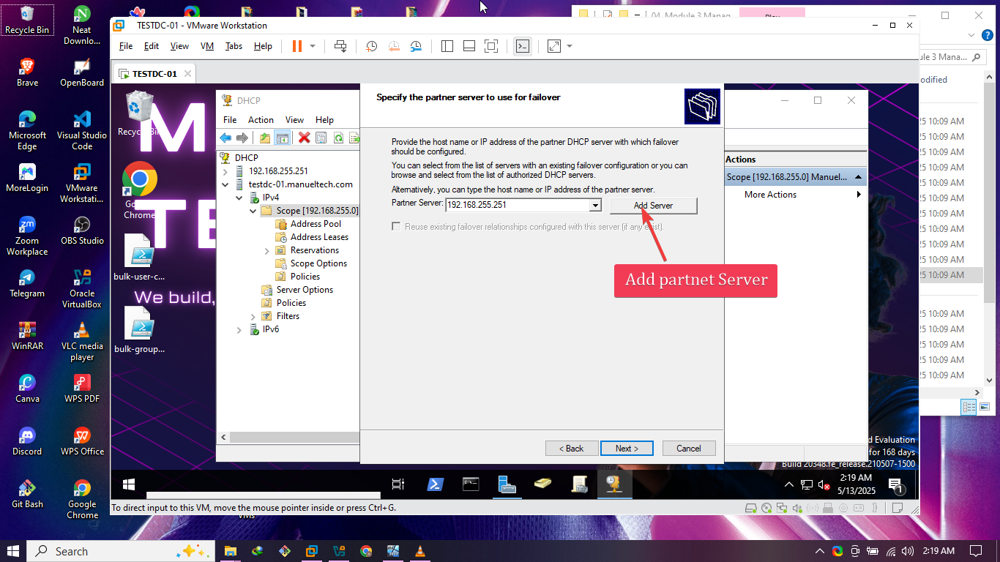
4. Chose **Load Balance** (70/30).
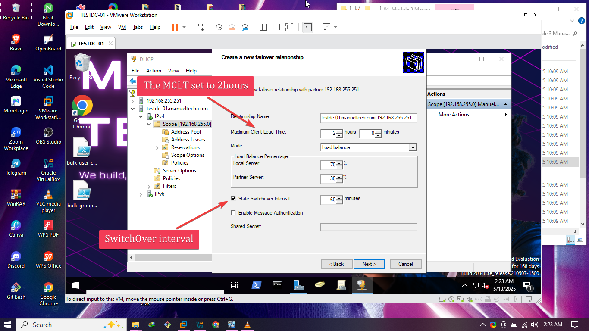
5. Relationship name for both servers.
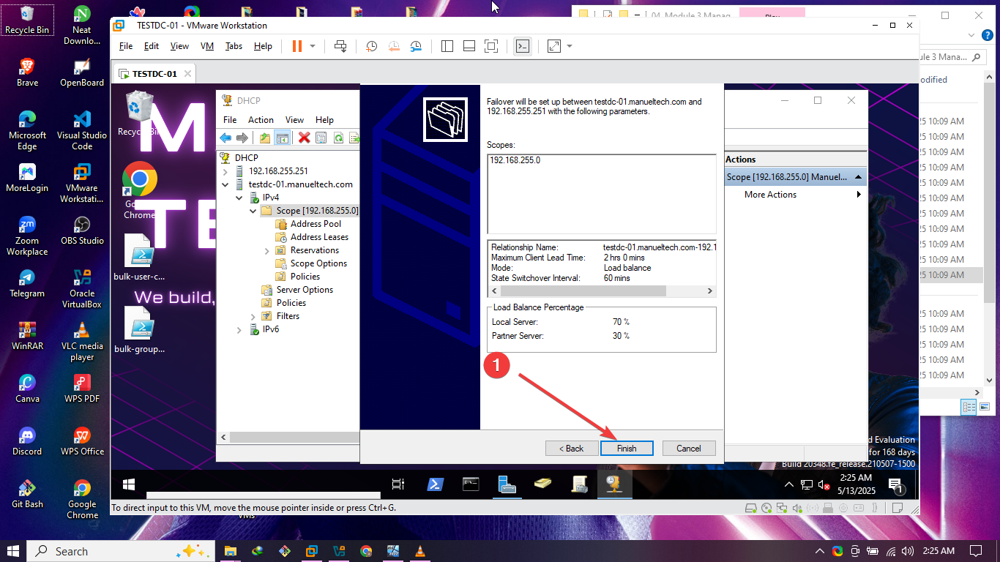
6. Completed the wizard and verified both servers showed green.
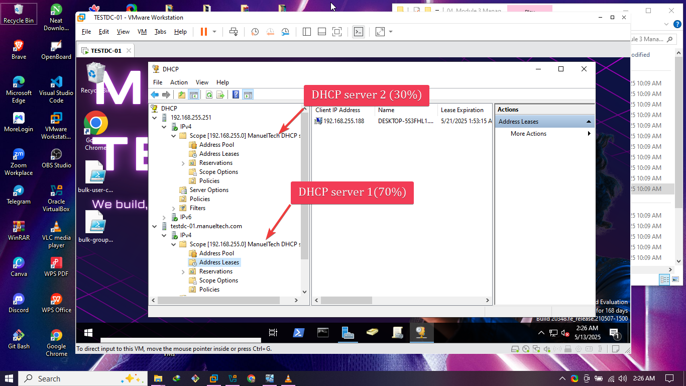

---

### 🔁 Step 6: Tested DHCP Redundancy

1. Disabled the DHCP service on `TESTDC-01` temporarily.
2. Renewed IP on `CLIENT-02` using `ipconfig /release` and `ipconfig /renew`.
3. It still received an IP — proof that **failover worked!** 🔥

---

## 📌 Key Concepts Demonstrated

- DHCP installation and configuration 🎛️
- AD integration for DHCP authorization 🔐
- DHCP scope setup with DNS and gateway 🎯
- Windows domain join and client testing 🧪
- DHCP failover using **Load Balancing mode** 🤝
- Hands-on testing for failover reliability ✅

---

## 🧠 What I Learned

- How to structure a real-world DHCP setup with redundancy.
- The importance of **MCLT** and how failover sync works.
- How DNS and DHCP roles integrate with AD.
- Troubleshooting tips for domain logins and client leases.

---

## 🧰 Tools & Tech Used

- Windows Server 2022
- Active Directory Domain Services
- DHCP Server Role
- Windows 10 Client VM
