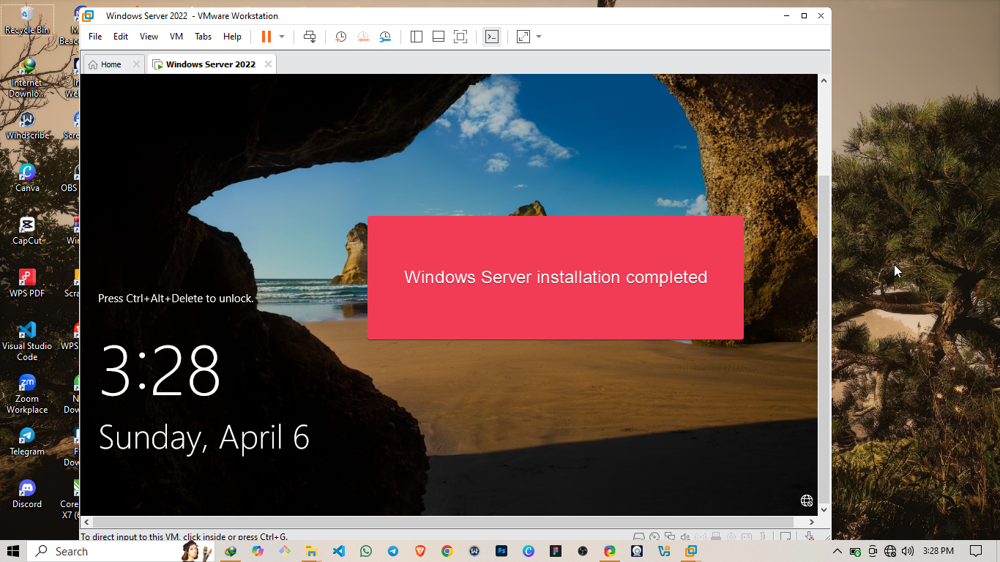
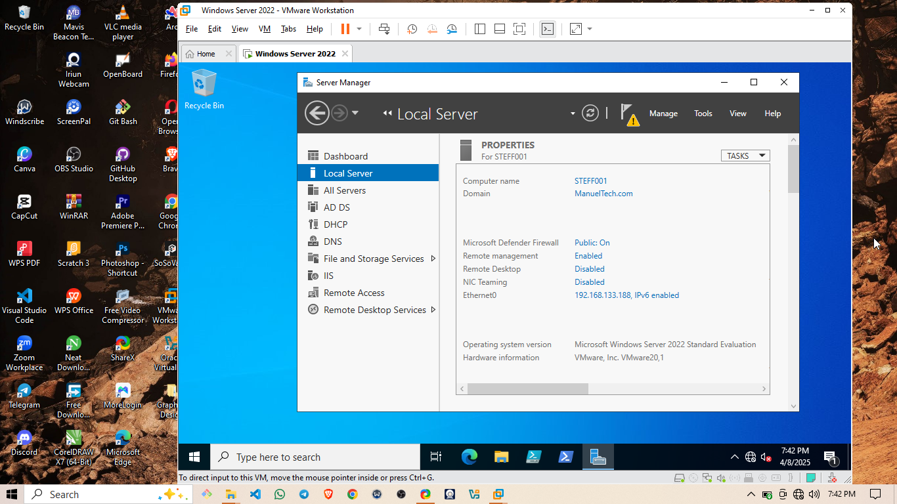

# 🖥️ Domain Controller Setup – Windows Server 2022  

## 📌 Overview  
As part of building my IT support portfolio, I set up a fully functional **Domain Controller** using **Windows Server 2022**. This project helped me understand core concepts behind Active Directory Domain Services (AD DS), DNS configuration, and centralized authentication in a Windows environment.

This document outlines the steps I took to install, configure, and test a domain controller from scratch in my home lab environment.

---

## 🛠️ System Environment  
- **OS:** Windows Server 2022 Standard (Evaluation) and Windows 10 (Client VM)
- **Lab Type:** Home lab (VMware Workstation pro)
- **Specs:**  
  - 2 vCPUs  
  - 2GB RAM  
  - 20GB Disk  

## 🧭 Project Goals  
- Install Windows Server 2022  
- Configure a static IP address  
- Install Active Directory Domain Services (AD DS)  
- Promote the server to a Domain Controller  
- Verify domain setup and DNS functionality  

---

## ⚙️ Step-by-Step Setup

### 1. 🖥️ Installed Windows Server 2022  
I started by installing Windows Server 2022 in a VirtualBox VM. I selected the "Desktop Experience" version for easier navigation.

### 2. 🌐 Set a Static IP  
Before installing AD DS, I configured a static IP to avoid network issues:
- Went to **Network and Sharing Center**
- Set a static IP (`192.168.133.188`)
- Used my router IP as the default gateway
- Preferred DNS was set to `127.0.0.1` (after DC setup)

---

### 3. 🧩 Installed AD DS Role  
- Opened **Server Manager**
- Chose **Add Roles and Features**

- Add some features to the Domain controller

- Add the DNS services

- Selected **Active Directory Domain Services**

---

### 4. 🏗️ Promoted the Server to a Domain Controller  
- Clicked the *Promote this server to a domain controller*

- Created a new forest: `Manueltech.com`
 

- Set a Directory Services Restore Mode (DSRM) password

- Set the NetBIOS name

- The server was successfully configured as a domain controller

- After a reboot, the server became the Domain Controller

---

### 5. 🔁 Verified the Setup  
- Logged in with the domain: `MANUELTECH\Administrator`

- Checked DNS and AD tools were installed:
  - **Active Directory Users and Computers**
  
  - **DNS Manager**
  
  - **Group Policy Management**

---

## 🧪 Testing  
To test the domain:
- I created a Windows 10 client VM

- Joined it to `Manueltech.com`

---

## 🧠 What I Learned  
- Importance of DNS integration in Active Directory  
- How to use AD tools like *Users and Computers*, *Group Policy*, and *Sites and Services*  
- Handling domain-join issues and verifying event logs for troubleshooting  
- Configuring network settings in virtual environments  

---

## 🔒 Next Steps  
This setup is part of my larger Active Directory project, which includes:
- Group Policy setup for client management  
- Creating and managing OUs and user accounts  
- Deploying login scripts and mapped drives  

---

## 🙌 Final Thoughts  
This project helped me solidify my understanding of how domain controllers work in real-world IT support environments. Being hands-on with this setup was a major confidence booster in my transition to enterprise-grade IT systems.
