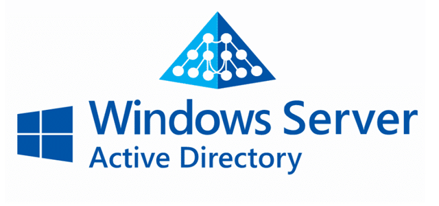

# 🖥️ Active Directory & Windows Server  

## 📌 About  
This repository showcases my hands-on experience with **Windows Server & Active Directory** in a home lab environment.  

## 🔹 Key Skills Demonstrated  
✔️ Set up **Active Directory Domain Services (AD DS)**  
✔️ Configured **Group Policy Objects (GPOs)**  
✔️ Managed **User Accounts & Permissions**  
✔️ Installed & configured **DNS, DHCP, and File Servers**  
✔️ Implemented **Firewall & Remote Desktop Services (RDS)**  

## 📁 Contents  
🔹 [Active Directory Setup](/Domain-Controller-Setup)  
🔹 [User Management](./Active-Directory/User-Management.md)  
🔹 [Group Policy Configurations](./Active-Directory/Group-Policy.md)  
🔹 [Windows Server Network Services](./Windows-Server/DHCP-Setup.md)  

