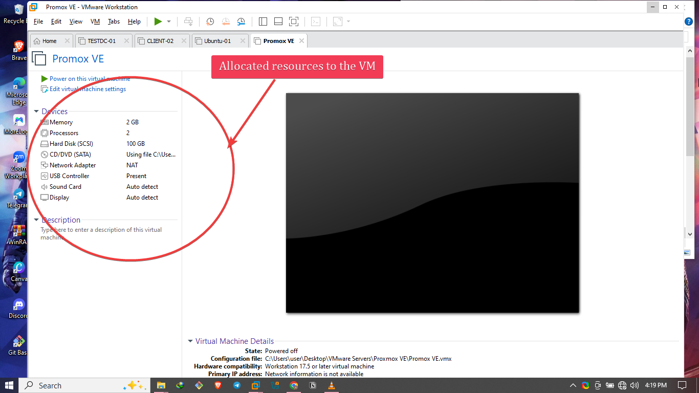
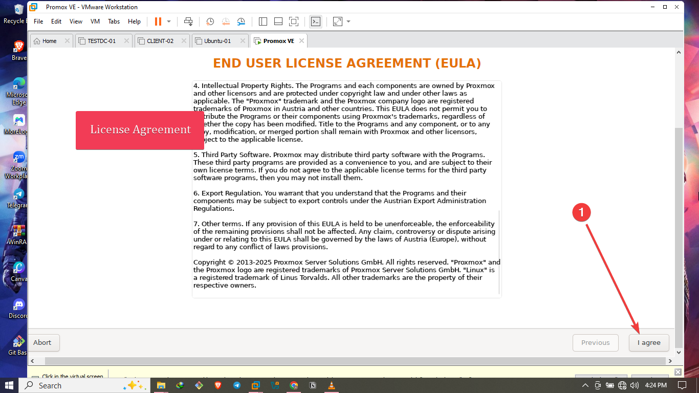

# Proxmox Home Lab Setup in VMware 🧪💻

Welcome to my Proxmox Virtual Environment (VE) setup, running inside **VMware Workstation** on my local PC. This guide walks through how I installed Proxmox, configured it, and accessed the web interface.

---

## ⚙️ System Specs

- **Host Machine:** My personal computer
- **Hypervisor:** VMware Workstation pro
- **Guest VM:** Proxmox VE
- **Proxmox VM Configuration:**
  - 🧠 **Memory:** 2 GB
  - ⚙️ **CPU:** 2 processors
  - 💾 **Disk Size:** 100 GB
  - 🌐 **Network:** Bridged (for direct access)
  - **Web Interface IP:** `https://192.168.255.190:8006`

---

## 📥 Step-by-Step Installation

### 1. 🔽 Download Proxmox VE ISO
- I downlaoded the ISO file from the official website: [https://www.proxmox.com/en/downloads](https://www.proxmox.com/en/downloads)
- Download the latest **Proxmox VE ISO Installer**

### 2. 🧱 Create a New Virtual Machine in VMware
- Open VMware Workstation or Player
- Click **Create New Virtual Machine**
- Select **Installer disc image file (ISO)** and choose the Proxmox ISO
- OS type: Select **Linux > Debian 12 64-bit**
- Name the VM `Proxmox01` or anything you like
- Allocate:
  - **2 GB RAM**
  - **2 processors**
  - **100 GB hard disk**
  - **Bridged Network Adapter**

### 3. 💿 Install Proxmox VE
- Boot the VM with the ISO
- Select **Install Proxmox VE** from the menu

- Accept the license agreement

- Choose the 100 GB disk you allocated

- Set the country, time zone, and keyboard layout

- Configure:
  - **Password:** Choose a secure root password
  - **Email:** Enter your admin email
  
- Network setup:
  - **IP Address:** Manually or automatically assigned (mine: `192.168.255.190`)
  
- Complete the installation and reboot

- Log into the proxmox terminal interface

---

## 🌐 Access the Proxmox Web Interface

### How to Access:
1. Open a browser on your host PC
2. I typed in `https://192.168.255.190:8006`
3. Ignore any SSL certificate warning and proceed
4. Login using:
   - **Username:** root
   - **Password:** emmylashtins
   
   

✅ I can now access the Proxmox dashboard!😎😁

---

## 🎉 What's Next?
With Proxmox up and running, I can:
- Create nested VMs
- Test clustering and storage
- Practice snapshots and backups
- Experiment with Linux/Windows VM setups

---

## ☁️ Future Plans
- Add ZFS storage
- Enable nested virtualization inside Proxmox
- Integrate with cloud-like solutions (Ceph, PBS, etc.)

---

Thanks for checking out my lab setup!

Happy homelabbing! 🛠️🚀
