# Ubuntu Home Lab Setup in VMware 🐧💻

This guide documents how I installed **Ubuntu** inside **VMware Workstation**, including system specs, installation steps, and what comes next. Perfect for testing, development, or a lightweight Linux desktop VM.

---

## ⚙️ System Specs

- **Host Machine:** My personal computer
- **Hypervisor:** VMware Workstation / Player
- **Guest OS:** Ubuntu 22.04 LTS (Desktop)
- **Ubuntu VM Configuration:**
  - 🧠 **Memory:** 2 GB
  - ⚙️ **CPU:** 2 processors
  - 💾 **Disk Size:** 30 GB
  - 🌐 **Network:** NAT

---

## 📥 Step-by-Step Installation

### 1. 🔽 Download Ubuntu ISO
- Go to the official Ubuntu download page:  
  [https://ubuntu.com/download/desktop](https://ubuntu.com/download/desktop)
- Download the latest LTS version (e.g., Ubuntu 22.04 LTS)

### 2. 🧱 Create a New Virtual Machine in VMware
- Open VMware Workstation or Player
- Click **Create New Virtual Machine**
- Choose:
  - **Typical (recommended)** setup
  - Select the **Ubuntu ISO** as installer image
- OS type: **Linux > Ubuntu 64-bit**
- Name the VM (Ubuntu-01)
- Allocate:
  - **2 GB RAM**
  - **2 processors**
  - **30 GB disk**

  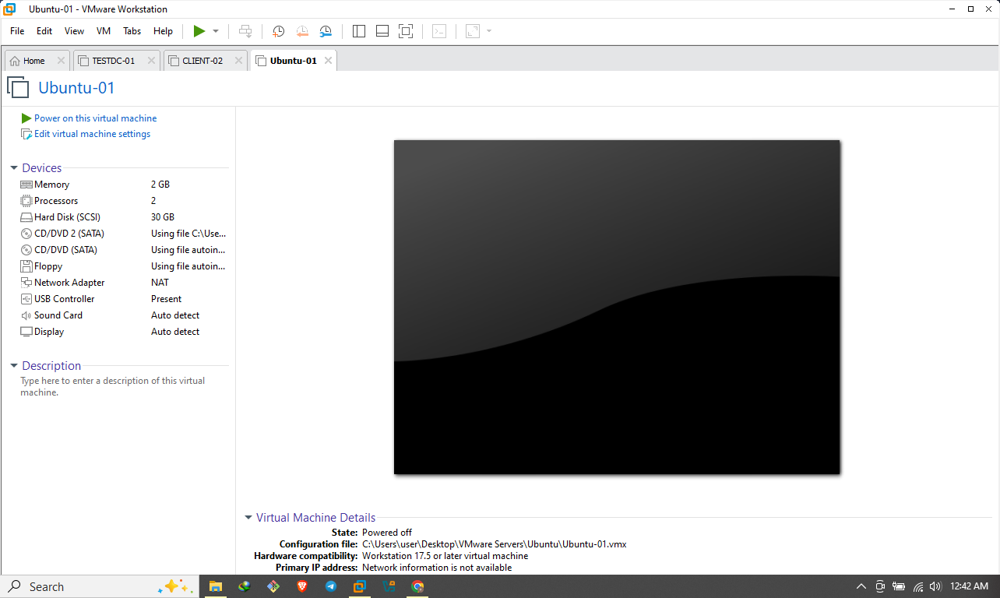

### 3. 💿 Install Ubuntu
- Start the VM
- Choose **Install Ubuntu**
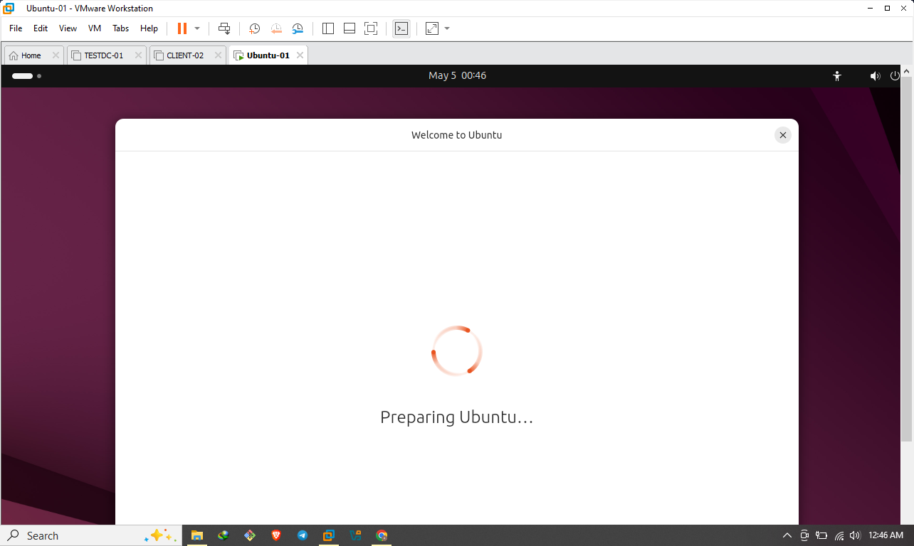
- Select language, keyboard, and **Normal Installation**
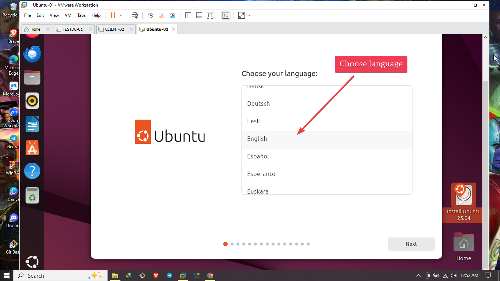
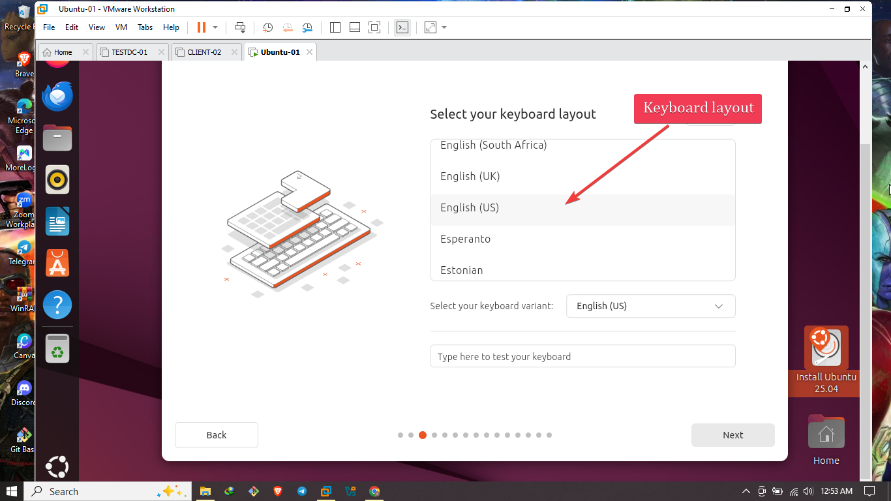

- Optionally check for updates during install
- Use entire disk (the virtual 30 GB)
- Set:
  - Your name, computer name, username, and password
  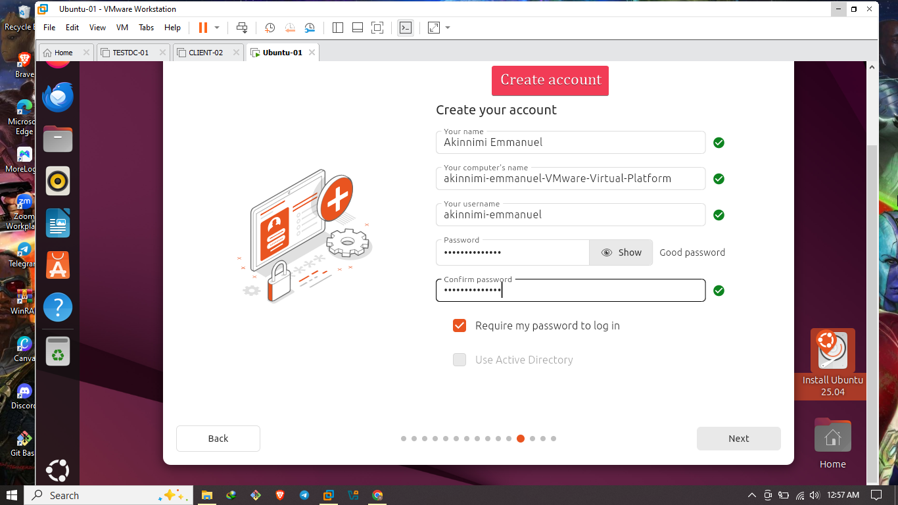
  

- Click **Install** and wait for completion
   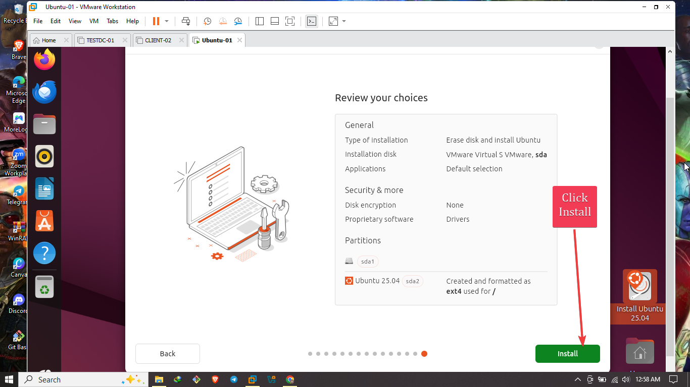
   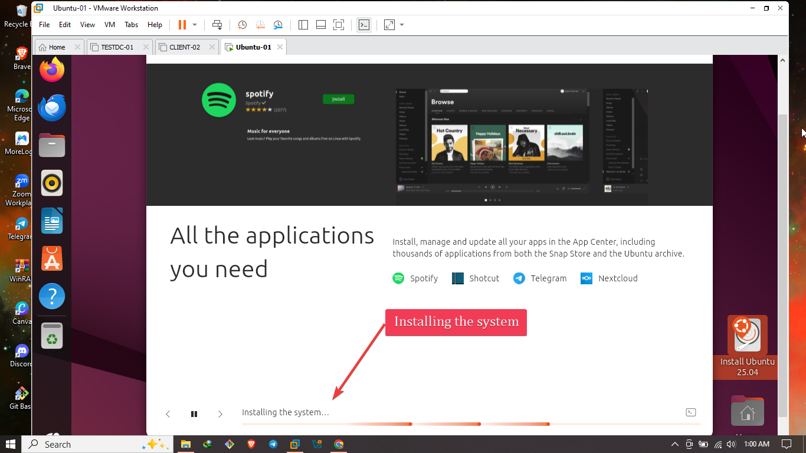
- Ubuntu Installed
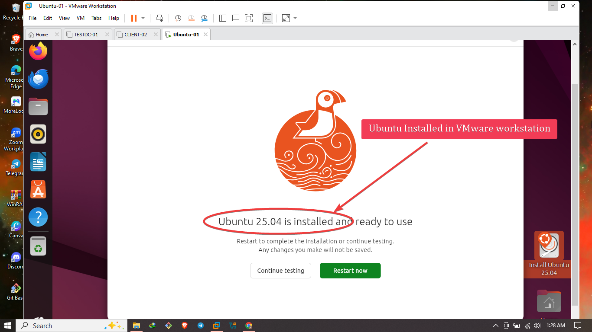
- Reboot the VM when prompted

---

## 🖥️ First Boot & Setup

Once the VM restarts:
- Log in using the username and password I created
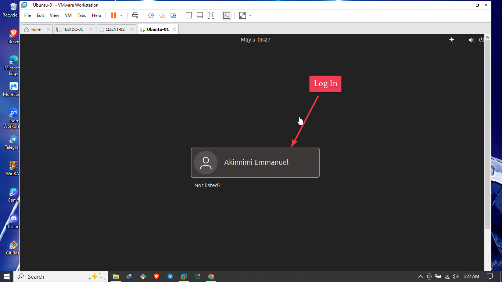
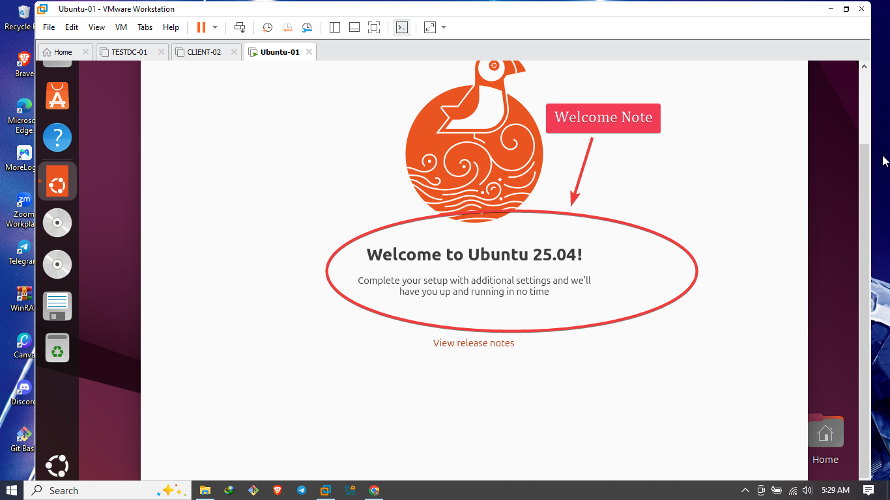
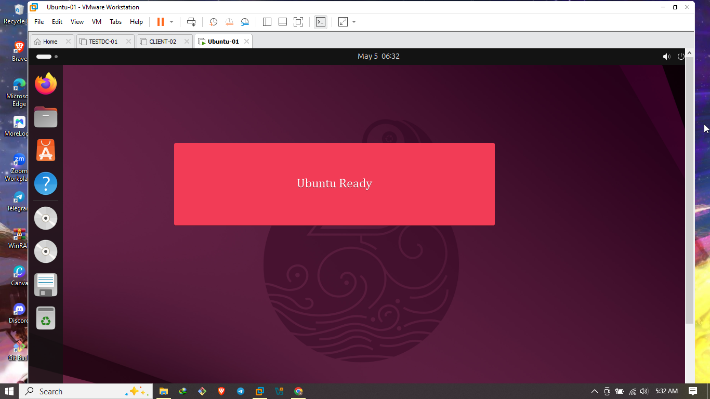
- Open **Settings > About** to confirm system details
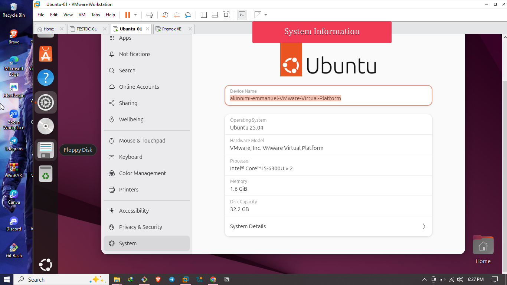
- Open Terminal to start exploring!
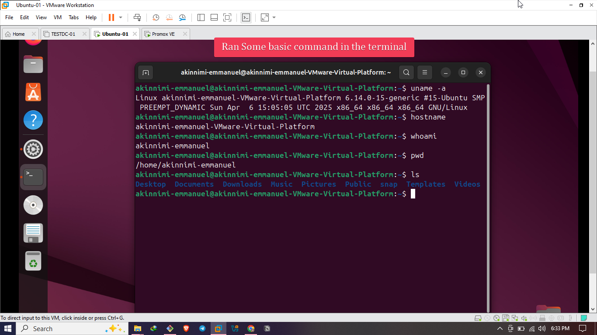
```bash
uname -a
hostname
whoami
pwd
ls
mkdir
```

```bash
sudo apt update && sudo apt upgrade -y
```
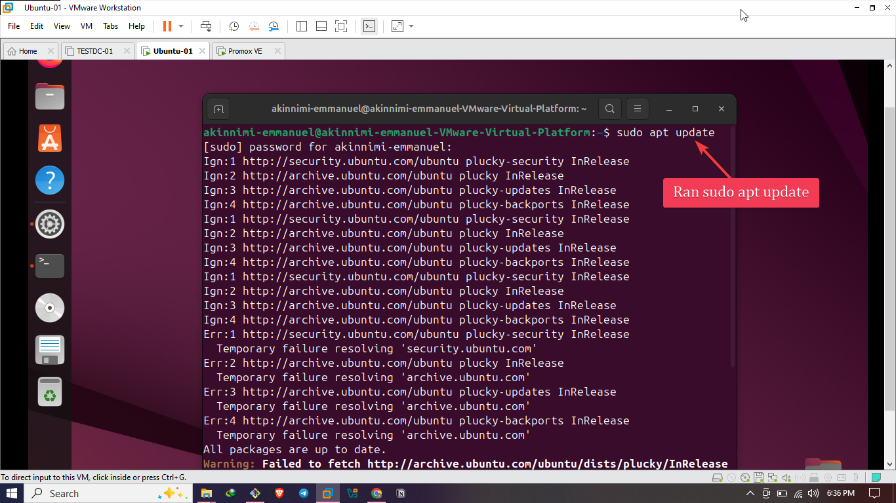

---

## ✅ What I plan to do With It

* 🧪 Test Linux commands and bash scripting
* 🕸 Set up SSH access and firewall rules
* 💻 Configure a basic web server
* 🔐 Experiment with tools like Docker, SSH, Git
* 🌍 Browse and access the internet in a secure VM

---

## ☁️ Future Plans

* Set up OpenSSH for remote access
* Install VS Code and development tools
* Create and snapshot multiple configurations
* Use Ubuntu as a base for LAMP/LEMP stack testing

---

Thanks for checking out my Ubuntu VM setup!

Happy hacking! 🧑‍💻🐧✨

