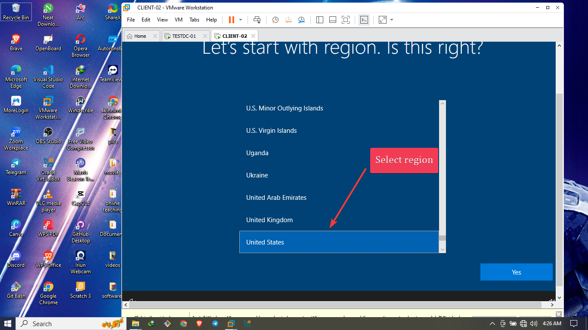

# 🧰 IT Support Portfolio: Installing Windows 10 on VMware & Joining Domain Controller (Manueltech.com)

## 🖥️ Project Title: Virtual Windows 10 Installation & Domain Join

## 🔍 Overview  
In this project, I installed Windows 10 on a **VMware Workstation** virtual machine and successfully joined it to the `Manueltech.com` domain. I manually configured the DNS settings on the VM to point to the domain controller's IP address. This process is essential in IT support for setting up client environments and connecting them to central Active Directory infrastructures. 💼🧑‍💻

---

## 💿 Environment Used
- **Host OS**: Windows 10
- **Virtualization Software**: VMware Workstation Pro
- **Guest OS**: Windows 10 Pro (ISO)
- **Domain Controller**: `Manueltech.com` (Hosted on a Windows Server VM)
- **Domain Controller IP**: `192.168.255.210`

---

## 🛠️ Step-by-Step Process

### ⚙️ Part 1: Creating the Windows 10 VM in VMware

1. 🧱 **Launched VMware Workstation** and selected **"Create a New Virtual Machine"**.
2. Selected the downloaded **Windows 10 ISO** as the installer disc image.
3. Assigned the VM name: `CLIENT-02`.
4. Set disk size to **40 GB** (split into multiple files).
5. Assigned **2 GB RAM** and **2 processors** to the VM.
6. Used **Bridged Networking** so the VM would be on the same LAN as the domain controller.
7. Completed the wizard and powered on the virtual machine.


---

### 💽 Part 2: Installing Windows 10 Pro on the VM

1. Booted from the ISO and selected **Install Now**.


3. Chose **Windows 10 Pro** edition (required for domain join).
4. Accepted license terms and selected **Custom Installation**.
5. Chose unallocated space and installed Windows.


6. After installation, went through the **Out-of-Box Experience (OOBE)**:
   - Region: Selected my location.
   
   - Keyboard: US layout.
   - Account setup: Chose **Offline Account**.
   - Created a local admin account:
     - Username: `CLIENT-01`
     - Password: ********
7. Disabled unnecessary privacy settings to streamline setup.
8. Completed setup and logged into Windows.


---

### 🌐 Part 3: Configuring Network & DNS Settings

1. Opened **Control Panel > Network and Sharing Center > Change adapter settings**.
2. Right-clicked **Ethernet** adapter ➡ Clicked **Properties**.
3. Selected **Internet Protocol Version 4 (TCP/IPv4)** ➡ Clicked **Properties**.
4. Manually configured DNS settings to point to the domain controller:
   ```text
   Preferred DNS Server: 192.168.255.210
   Alternate DNS Server: (left blank)
   ```
5. Saved changes and closed all windows.

---

### 🔗 Part 4: Joining the Domain (Manueltech.com)

1. Opened **System Properties** via:
   - Right-click **This PC** ➡ **Properties** ➡ **Rename this pc(advanced)**.
   
2. Clicked **Change...** under **Computer Name** tab.


3. Selected **Domain** and typed:
   ```text
   Manueltech.com
   ```
   
4. Entered domain admin credentials when prompted.
5. Received the confirmation message
   > “Welcome to the Manueltech.com domain!” 🎉
   
6. Went to check the computer name under computers in the domain controller

6. Restarted the VM to apply domain membership.

---

### 👤 Part 5: Logging in with Domain Account

1. At the login screen, selected **Other User**.
2. Typed in the user credentials to sign into the domain:
   
3. Paasword change:


4. Logged into the domain user account successfully.

5. Verified domain group policies and network connectivity were applying correctly.:✅😎✌


---

## ✅ Outcome
This project allowed me to simulate a real-world IT support task: deploying a virtual client system and integrating it into an enterprise network. Joining the domain through proper DNS and network configuration proved successful. The VM now interacts securely with the domain controller, and the experience boosted my confidence in AD-based setups. 💪

---

## 🧠 Lessons Learned
- Importance of correct edition (Pro vs Home) for domain join
- VMware bridged network mode enables LAN-level access
- DNS must point to domain controller — not external resolvers (like 8.8.8.8)
- Offline account setup allows pre-domain configurations
- Always flush and renew IP before joining the domain

---

## 🔚 Conclusion
Setting up Windows 10 on VMware and integrating it into a domain (Manueltech.com) is an essential skill in any IT support or sysadmin role. Through this task, I strengthened my understanding of DNS, domain join prerequisites, and VM configuration. 🚀
