# 🪟 Windows Server Setup Guide

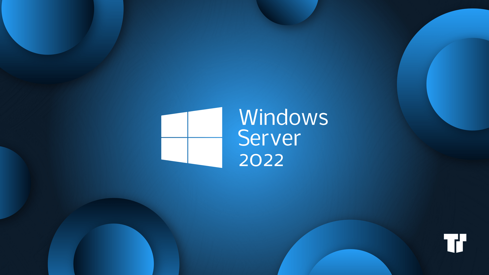

This guide documents the steps I took to install and configure **Windows Server 2022** in my home lab. I used this environment to practice system administration tasks such as Active Directory, DNS, DHCP, file sharing, and more.


## ✅ Requirements

- **Windows Server ISO** (Windows Server 2022)
- Virtualization platform (VMware)
- Laptop configuration **2 GB RAM**, **2 CPUs**, and **20 GB** disk space
- Internet connection for activation and updates

## 🛠️ Installation Steps

### 1. Create a Virtual Machine

- I Opened my VMware workstation pro and created a new VM with the following specs:
  - **Name**: Windows Server
  - **Type**: Microsoft Windows
  - **Version**: Windows 2022 (64-bit)
  - **RAM**: 2096 MB (minimum)
  - **CPU**: 2 cores
  - **Disk**: 20 GB

 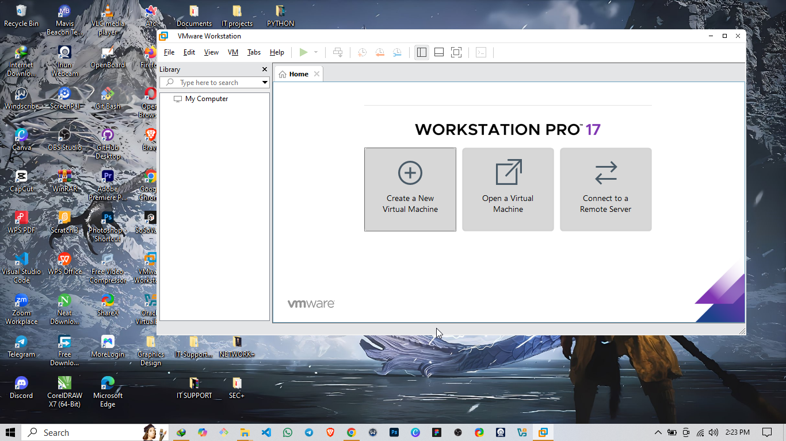

 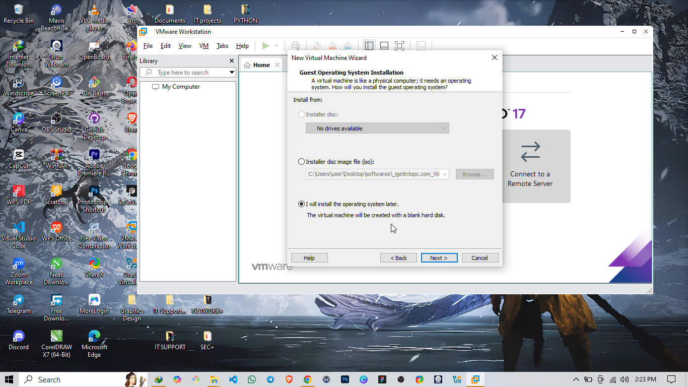

 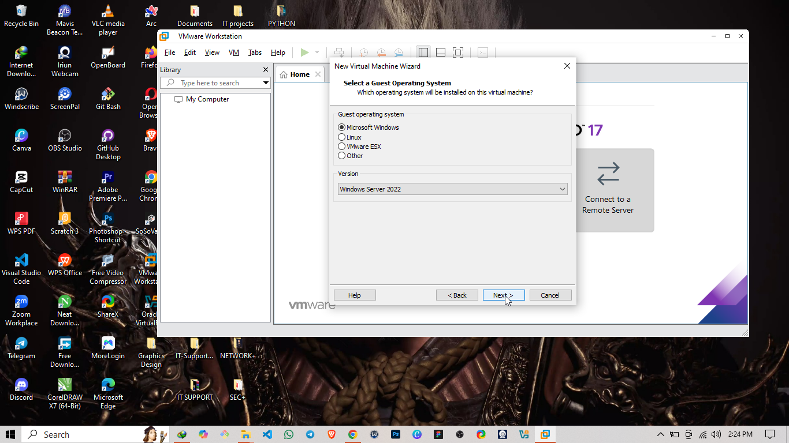

 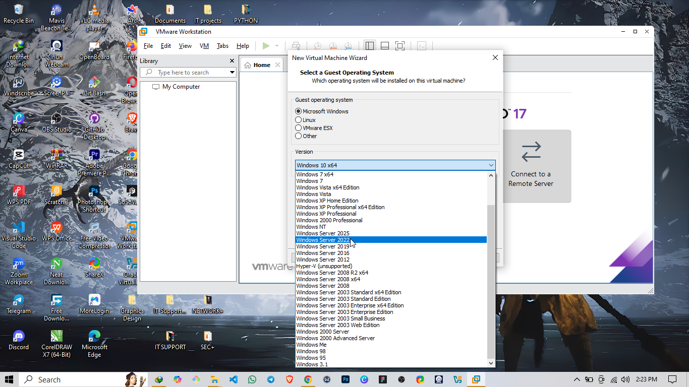

 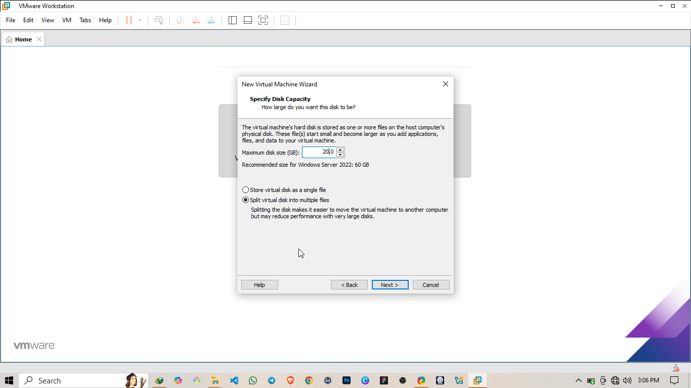


### 2. Mount the ISO & Boot

- I went back to settings to attach the Windows Server ISO to the virtual CD/DVD drive
 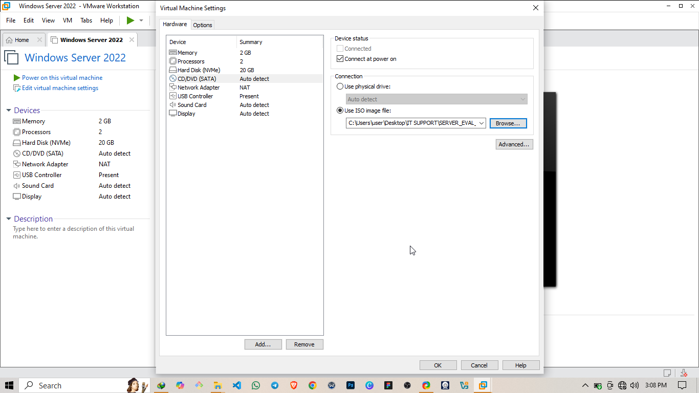

- I Started the VM by pressing the play button
  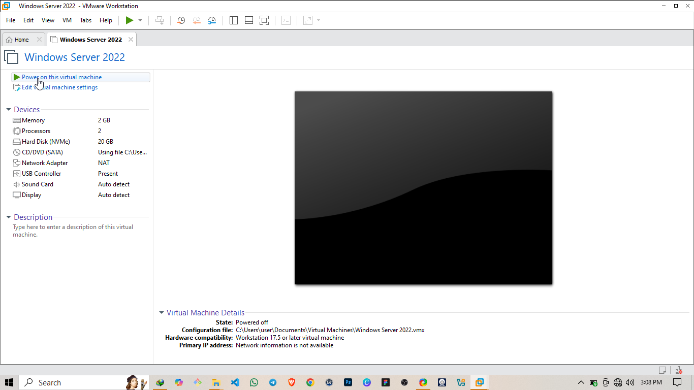

- Choose:
  - Language: English (United States)
  - Time and currency: English (US)
  - Keyboard: US

 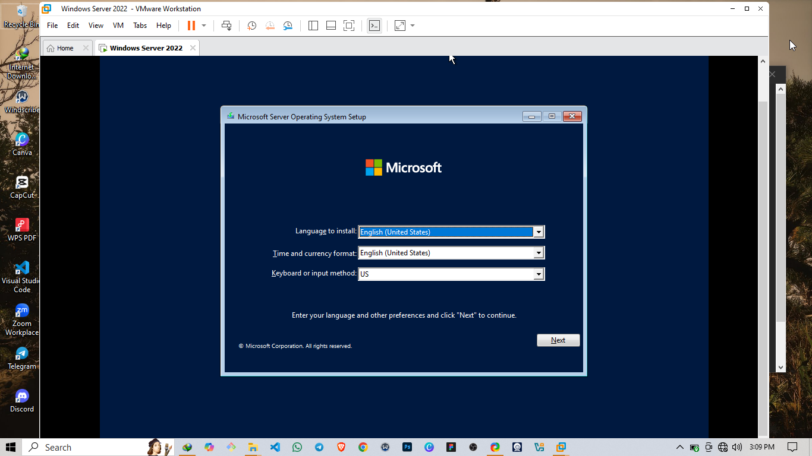

- Choose edition: **Windows Server Standard (Desktop Experience)**

 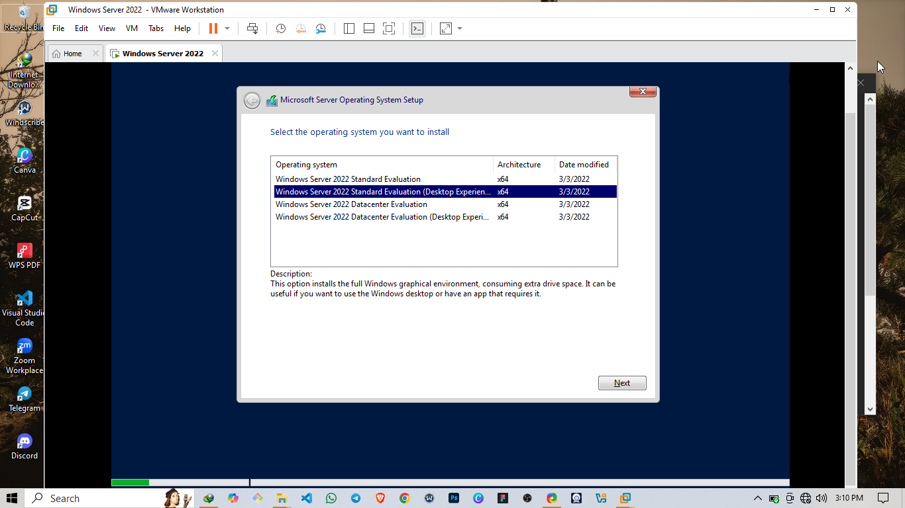

### 3. Begin Installation

- Installing microsoft server operating system

  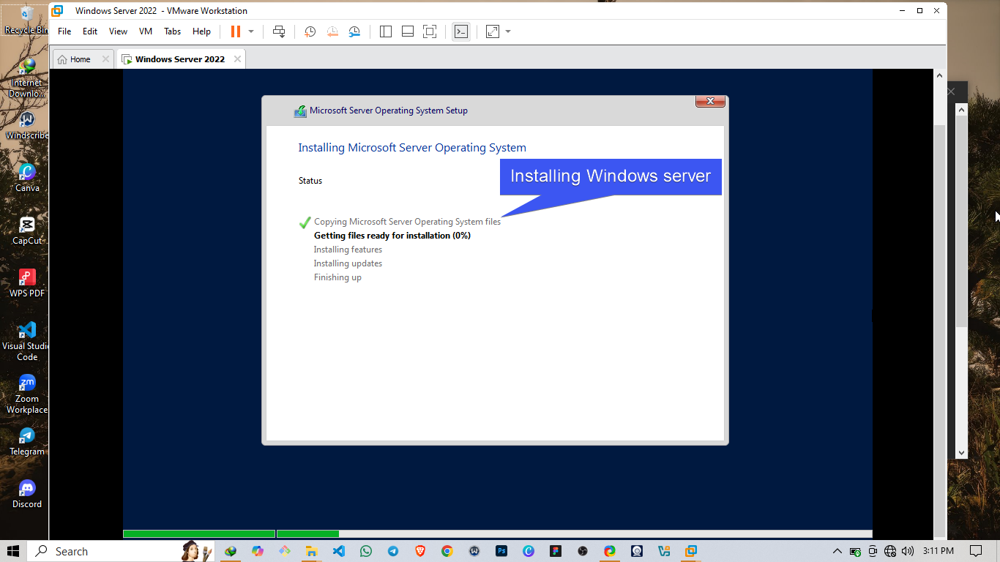


## 🧱 Post-Installation Setup

### 4. Set Administrator Password

- Once installation finishes,I set a strong admin password
 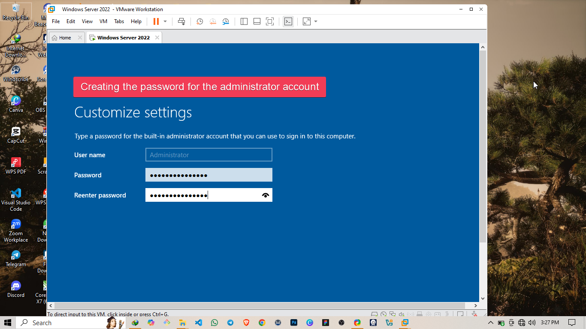

- Installation completed
  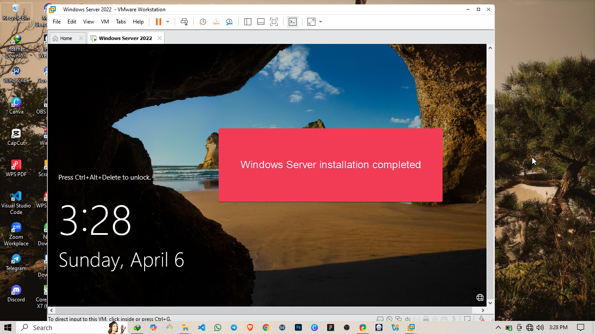

- Server manager up and running
 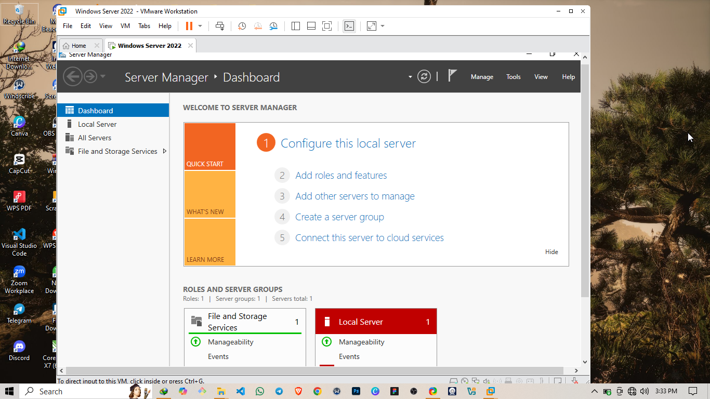


### 5. Install Guest Additions VMware Tools

- This helps with better resolution, clipboard sharing, etc.

### 6. Set Static IP Address

- I went to the `Control Panel > Network and Sharing Center > Change adapter settings`
- Right-click on Ethernet > Properties > IPv4
- Then I Set an IP and use google DNS:
  - IP Address: `192.168.x.x`
  - Subnet Mask: `255.255.255.0`
  - Gateway: `192.168.x.1`
  - DNS: `8.8.8.8`


## ⚙️ Basic Configuration

### 7. Rename the Server

- I Opened PowerShell as Admin and use the following command to rename my serverto STEF001 and restarted immediately so the changed can take effect:
  ```powershell
  Rename-Computer -NewName "STEFF-001" -Restart


🧠 Lessons Learned
   - Always install Guest Additions early for better usability

   - Static IPs make domain services much easier to configure

   - PowerShell is your best friend for automation

