# 🖥️🔧 Basic LAN & WLAN Setup (Cisco Packet Tracer)

Welcome to my **Basic LAN & Wireless LAN Setup** project!  
This lab is one of my early hands-on exercises with networking fundamentals using **Cisco Packet Tracer**. It combines **wired and wireless networking**, **DHCP**, **static IPs**, **default gateway configuration**, and some basic **inter-device communication**. 🚀

---

## 🗂️ Topology Overview

Here's what I built:

### 🌐 LAN Segment
- 🖥️ **5 PCs**
- 🖨️ **2 Printers** (with static IPs)
- 🔌 **2 Switches**
- 🌐 **1 Router** (with DHCP enabled)

### 📡 Wireless Segment
- 💻 **3 Laptops**
- 📶 **1 Wireless Router** (separate network)

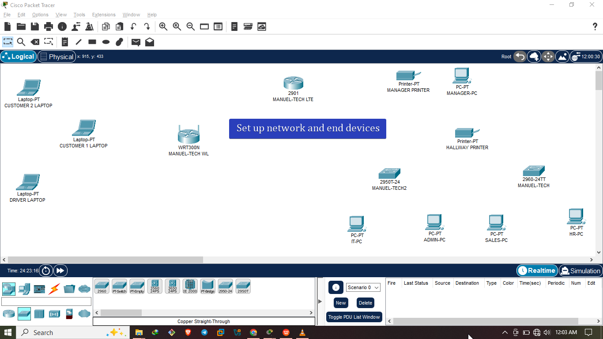

---

## 🛠️ Configuration Steps

### 1️⃣ Connecting Devices
- PCs and printers were connected to the two switches using **copper straight-through cables**.

- Switches were connected to each other and to the **router**.
- Wireless router connected via **Ethernet to the router** (for internet simulation).
- Laptops connected wirelessly using the **SSID and WPA2 security**.
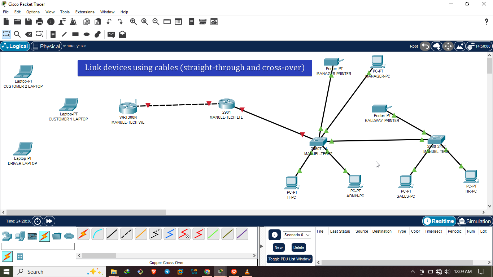

### 2️⃣ IP Addressing

#### Assign each segment thier own IP address
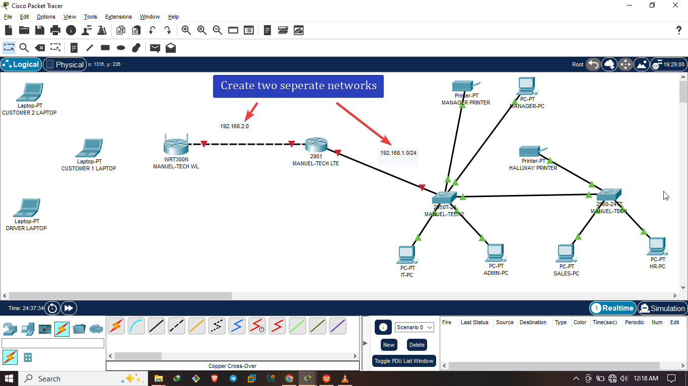
- Clicked on router -> CLI -> typed in the following commands to enable port
```
int gi0/0
no shut
exit
int gi0/1
no shut
exit 
do wr
``` 
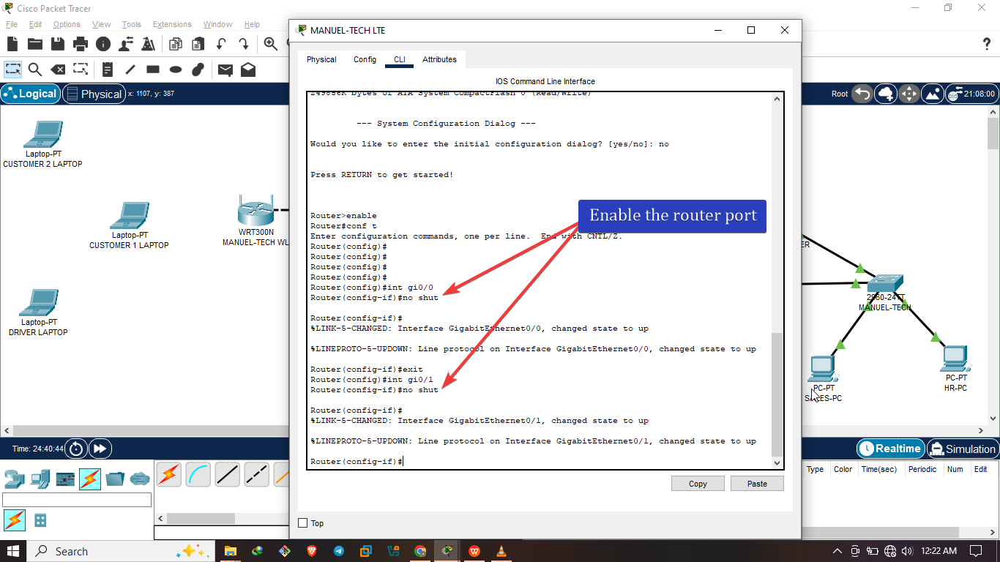

#### 📦 LAN Devices (PCs & Printers)
- **DHCP** enabled on the router interface for PCs:
  - **Network:** `192.168.1.0/24`
  - **Default Gateway:** `192.168.1.1`
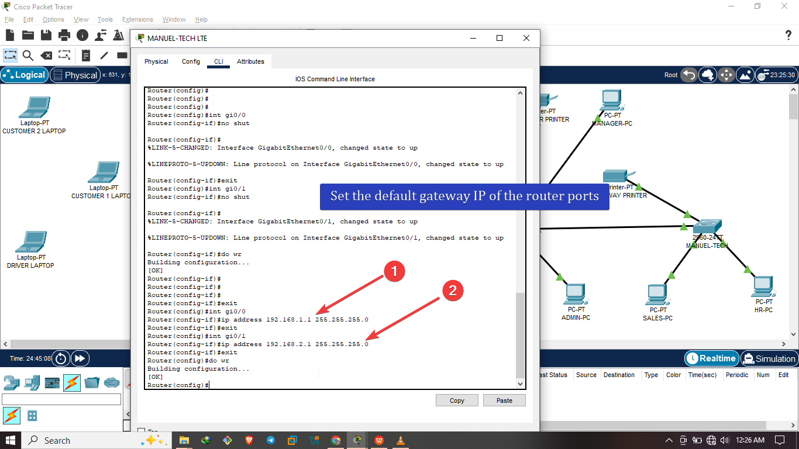


- 🖨️ **Printers** were manually assigned:
  - HALLWAY printer: `192.168.1.105`
  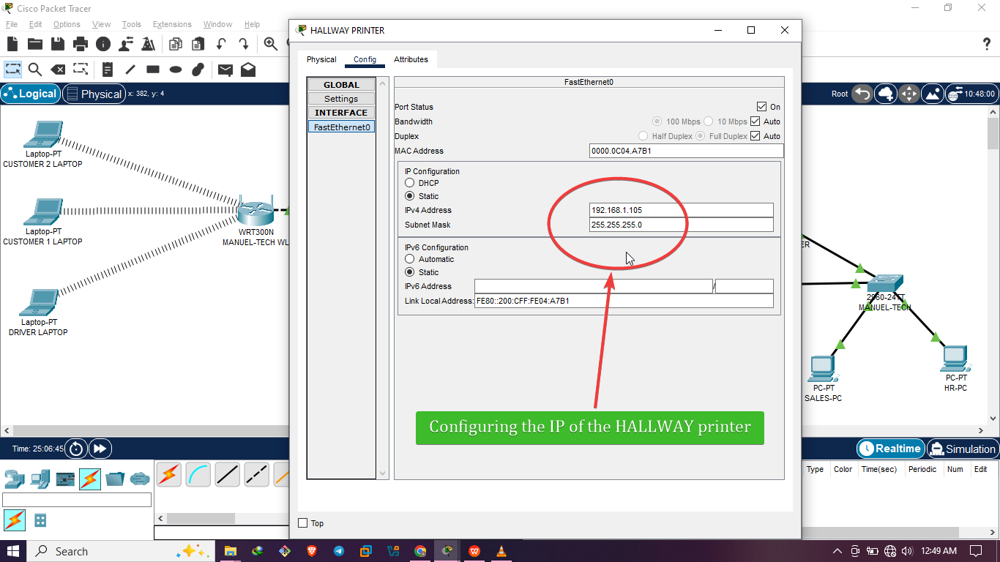
  - MANAGER printer: `192.168.1.107`
  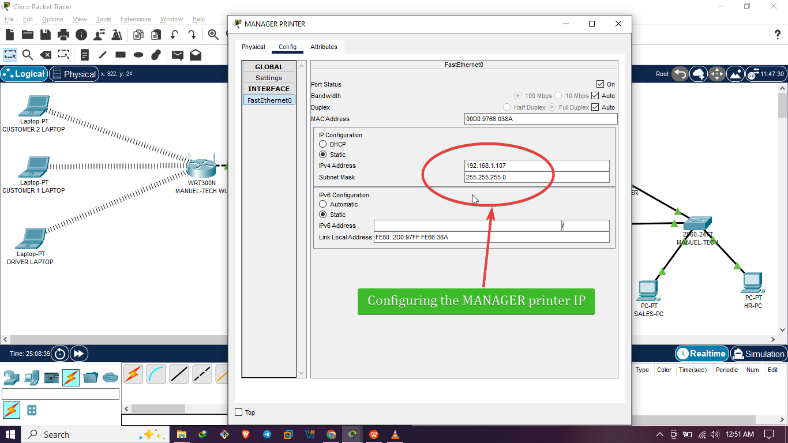

#### 🌐 Router Configuration (LAN Side)

```bash
interface GigabitEthernet0/0
 ip address 192.168.1.1 255.255.255.0
exit

ip dhcp pool WiredLAN
 network 192.168.1.0 255.255.255.0
 default-router 192.168.1.1
 
```
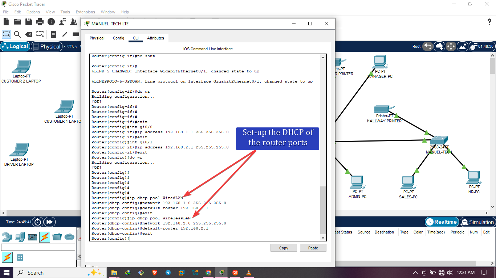

#### 🌐 Router Configuration (WLAN Side)

```bash
interface GigabitEthernet0/1
 ip address 192.168.2.1 255.255.255.0
exit

ip dhcp pool WirelessLAN
 network 192.168.2.0 255.255.255.0
 default-router 192.168.2.1

```


### 3️⃣ Wireless Router & WLAN

* Wireless Router configured with a different **subnet**:

  * Network: `192.168.2.0/24`
  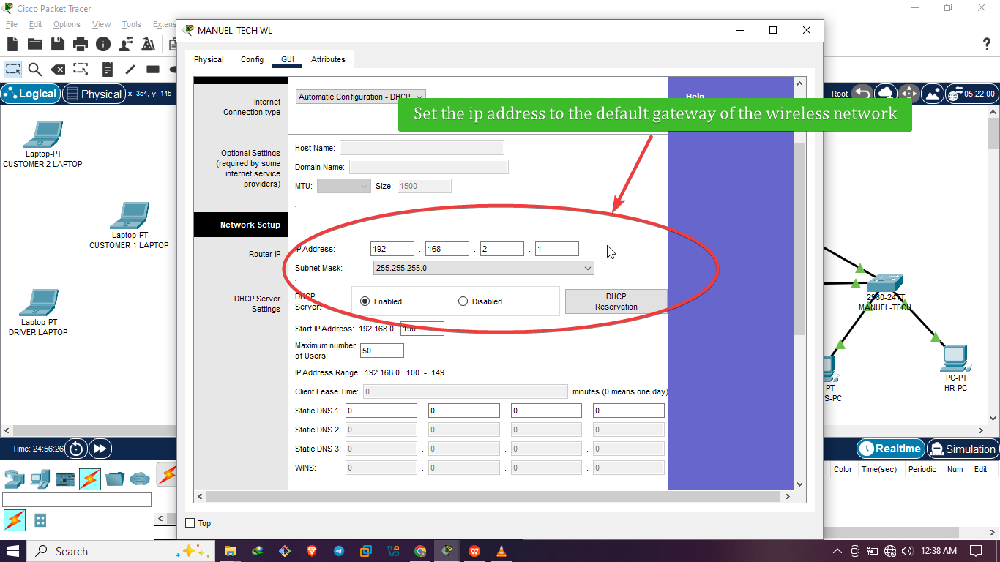
  * SSID: `MANUEL-TECH3`
  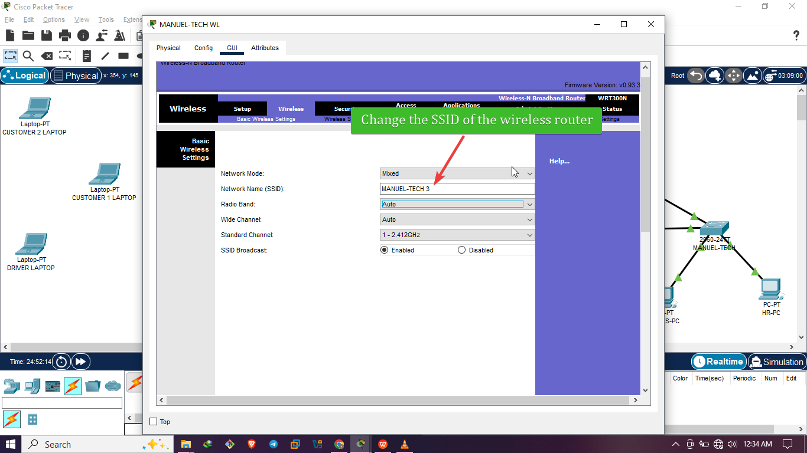
  * Security: WPA2-PSK, Password: `emmylashtins22`
  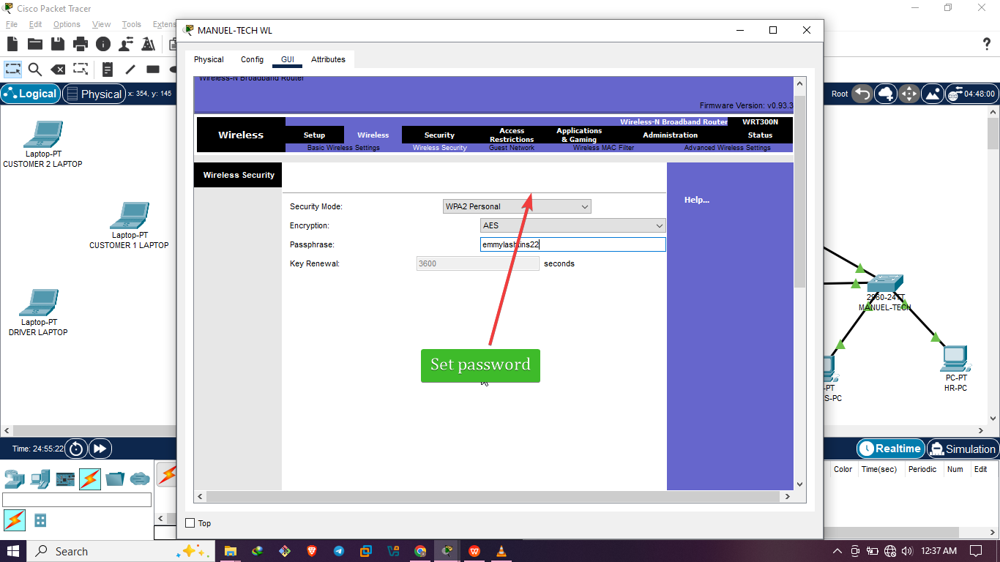

* Laptops successfully connected to `MANUEL-TECH3` and acquired IPs automatically.
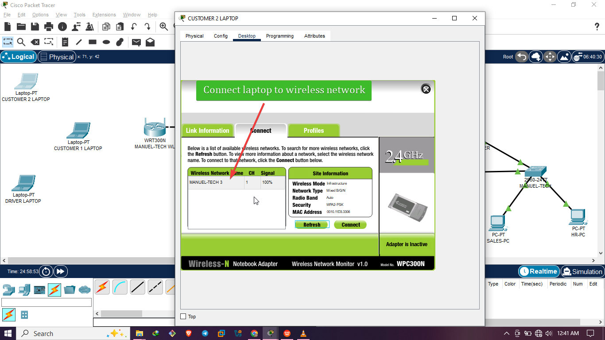

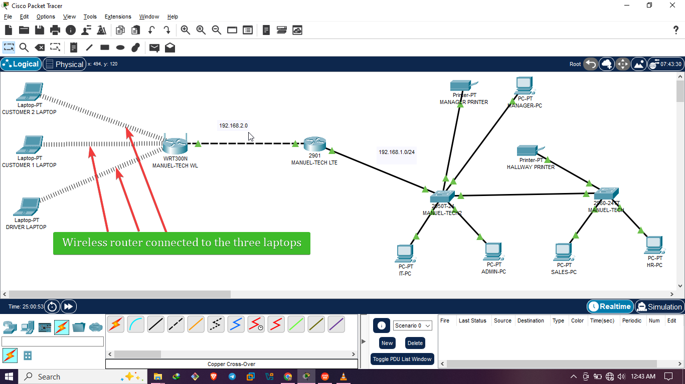

### PCs DHCP successful
- IT-PC DHCP successful
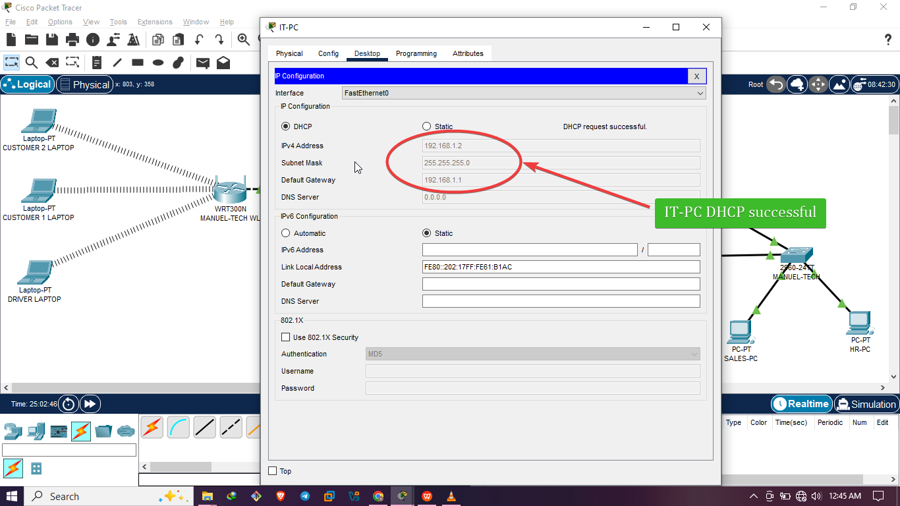
- Admin PC DHCP successful


---

## 🧪 Testing & Verification

✅ **PCs pinged each other successfully** across both switches.
✅ **All PCs printed to both printers** using static IPs.
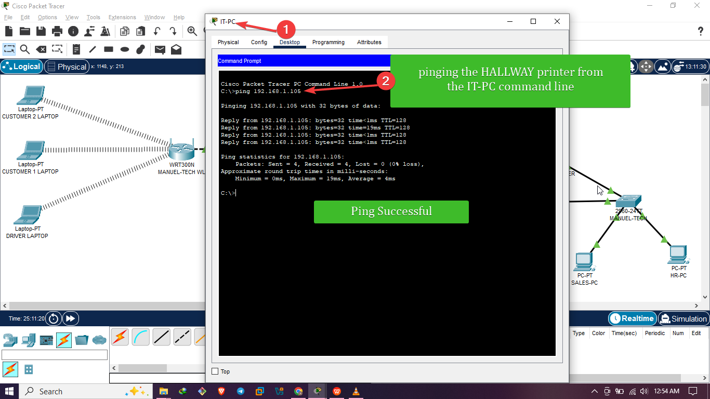
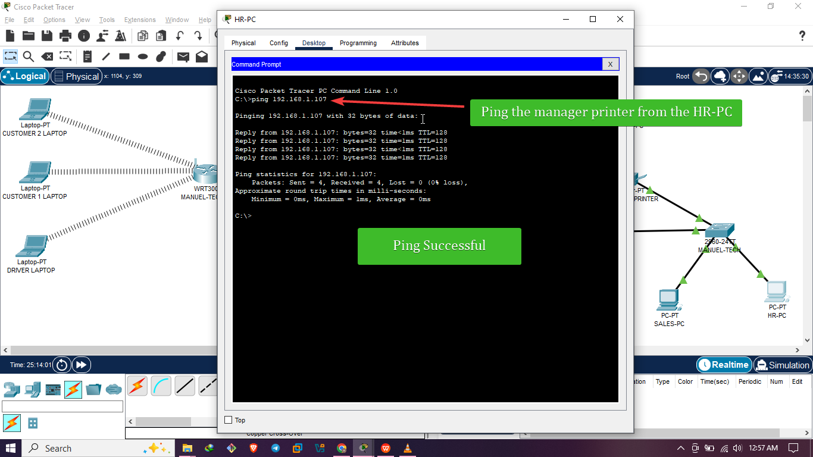
✅ **Laptops browsed the internet (simulated)** through the wireless router.
✅ **Ping tests confirmed separation of LAN and WLAN** unless routing is manually added.

---

## 🧠 What I Learned

* Setting up **interconnected switches** for scalable LANs
* Configuring **DHCP** on routers and understanding address pools
* Assigning **static IPs** for key network devices like printers
* Creating a **segmented wireless network** using a wireless router
* Using **basic commands** like `ping`, `ipconfig`, `show ip dhcp binding`, etc., to troubleshoot

---

## 📌 Future Improvements

* Introduce **VLANs** for better segmentation
* Enable **Inter-VLAN routing** for communication between wireless and wired networks
* Add **firewall ACLs** for basic security
* Simulate **internet access** through NAT configuration

