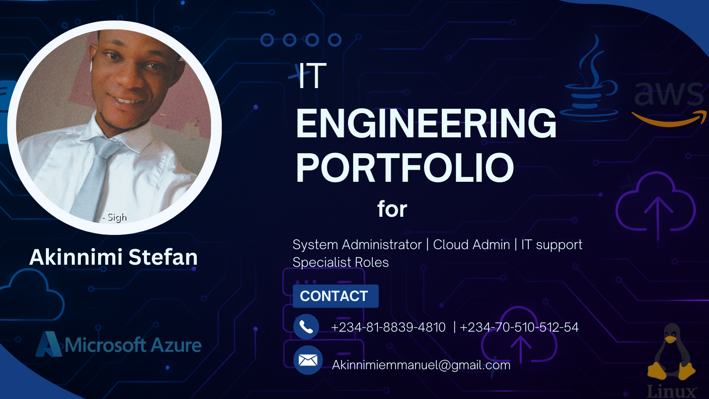

# IT-Engineering-Portfolio

🔧 All-in-One Infrastructure Portfolio
💻 M365 | ☁️ Cloud | 🐧 Linux | 🛠️ IT Support

Welcome to my IT Engineering Portfolio! This is where I showcase my skills in troubleshooting, system administration, and technical support.  

## 🛠️ Home Lab Setup  
I have built a **virtual IT lab** on my laptop to practice real-world IT tasks. Here are some key setups:  

✅ **Windows Server 2022 with Active Directory** – [Read More](Active-Directory/Domain-Controller-Setup)  
✅ **Microsoft 365 Admin Center** – [Read More](./microsoft-365.md)  
✅ **Basic Networking (DNS, DHCP, IP Config)** – [Read More](Networking/Basic-LAN-Set-up)

---

## 🔧 Troubleshooting Case Studies  

### **1️⃣ Fixing a Slow Windows PC**  
**Problem:** A user complained that their Windows 10 laptop was running very slowly.  
**Solution:**  
- Disabled unnecessary startup programs  
- Cleared temporary files using `disk cleanup`  
- Upgraded RAM from 4GB to 8GB  
**Outcome:** The system performance improved significantly.  
[Read Full Guide](Troubleshooting/Perfromance-Isuues&Start-up)  

### **2️⃣ Resetting a Microsoft 365 Password**  
**Problem:** A user forgot their Microsoft 365 password and couldn’t log in.  
**Solution:**  
- Logged into **Microsoft Admin Center**  
- Reset the password and enabled Multi-Factor Authentication (MFA)  
**Outcome:** The user regained access securely.  
[Read Full Guide](./microsoft-365-password-reset.md)  

### **3️⃣ Troubleshooting a Network Issue**  
**Problem:** A user Laptop was connected to Wi-Fi but no internet  
**Solution:**  
- Ran `ipconfig /all` to check the IP configuration  
- Checked proxy and DNS configuration
- Used the built-in troubleshooter
- Ran key commands via CMD
- Updated the Wi-Fi adapter

**Outcome:** The connection was restored successfully.  
[Read Full Guide](Troubleshooting/WIFI-issues/WIFI-issues.md)  

## 🏆 Skills & Technologies  
- ✅ Windows & Linux System Administration  
- ✅ Microsoft 365 User Management  
- ✅ Active Directory & Group Policy  
- ✅ Networking (DNS, DHCP, IP Configuration)  
- ✅ Remote Support (AnyDesk, TeamViewer, RDP)  
- ✅ Ticketing Systems (Jira, Freshdesk, Zendesk)
- ✅ Voip Administration
- ✅ Security
- ✅ Cloud Administration
- ✅ Scripting and Automation

📩 Contact me: [akinnimiemmanuel@gmail.com] | [LinkedIn Profile]  
