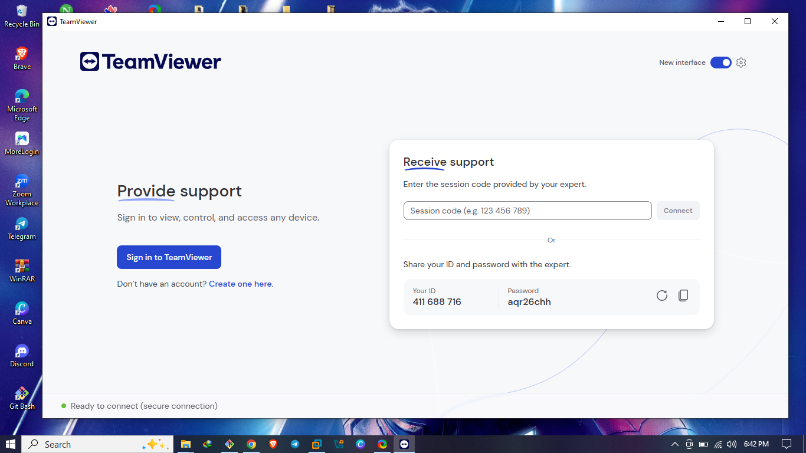

# TeamViewer Setup Guide

Welcome to my TeamViewer documentation!  
As part of my remote support toolkit, I use TeamViewer for secure, real-time remote access and support. It’s one of the most popular tools in the industry, and this guide documents how I set it up, key features I explored, and how I use it for IT support purposes.

---

## Why TeamViewer?

I chose TeamViewer because:
- It's beginner-friendly and quick to deploy
- It supports unattended access
- It has strong encryption and multi-platform compatibility
- It’s widely used in professional support environments

---

## Installation Steps

### On Windows:
1. Download the installer from [https://www.teamviewer.com](https://www.teamviewer.com)

2. Run the installer and choose:
   - **Default installation** for remote control and access
   - Or **Unattended access** if you plan to use it regularly
3. Follow the prompts to complete installation

### On macOS or Linux:
- Similar steps as above, but with extra permissions required (especially on macOS for screen sharing and control)

---

## Initial Setup

1. Launch TeamViewer after installation

2. Take note of the **Your ID** and **Password** — these are used by others to connect to your machine

---

## Real-World Use Case

When helping users remotely, I typically:
- Ask for their TeamViewer ID and temporary password
- Connect to their device securely
- Guide them through issues or take control to fix problems directly

I also use the file transfer feature to send tools or retrieve logs.

---

## Security Settings

Some things I make sure to configure:
- Enable **two-factor authentication** on my TeamViewer account

- Disable random password generation if using unattended access

---

## Tips for Smooth Sessions

- Always ask the user to disable sleep mode during long sessions
- Use the chat feature to keep communication flowing
- Adjust quality settings if the connection is laggy

---

## Final Thoughts

TeamViewer is a reliable and essential part of my remote support toolkit. While there are other tools available, its ease of use and rich features make it a go-to for quick and professional support.

