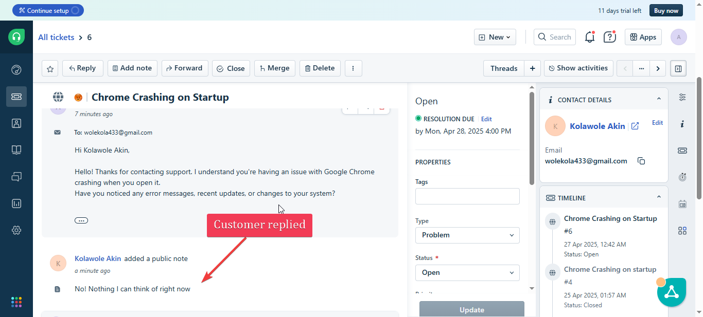

# 📩 Freshdesk Ticket Creation & Resolution – Chrome App Crash

## 👨‍💻 Technician: Emmanuel Stefan  
**Date:** [27-04-2025]  
**Scenario Type:** Application Crash  
**Simulation Tools:**  
- **Client Side:** Windows 10 VM (simulated end-user system)  
- **Technician Side:** My personal PC  
- **Remote Tool:** TeamViewer  
- **Ticketing Tool:** Freshdesk (Web-based)

---

## 🧪 Objective

Simulate the lifecycle of a real-world IT support ticket using **Freshdesk** for a Chrome application crash scenario. This included:
- Logging a ticket from the user side (via Freshdesk portal)
- Receiving and attending to the ticket from my technician dashboard
- Solving the issue remotely via TeamViewer
- Documenting the fix and closing the ticket professionally

---

## 📝 Step-by-Step Process

### 1. 🧑‍💻 Created a Freshdesk User Account on the VM
- Opened Freshdesk portal on the Windows 10 VM.
- Registered a simulated user (e.g., `john.doe@fakeemail.com`).
- Submitted a **new support ticket** titled:  
  > "Chrome Crashing on Startup"

**Ticket Content:**
```text
Each time I tried to open chrome it keeps crashing after a few seconds. I already restarted the pc, but it keeps happening. 
```


---

### 2. 🎫 Technician Dashboard – Receiving the Ticket
- Logged into my **Freshdesk Agent account** on my real PC.
- Received the ticket in my agent inbox.

- Opened the ticket and reviewed the user description.
- Assigned ticket to myself, Set **Ticket Priority** to `Medium` and **Status** to `Waiting on customer`.
- Replied the customer:  
  
- Customer reply
  
- Instruction on how to download Teamviewer for remote troubleshooting
  
- Teamviwer credentials for remote support
  
---

### 3. 🖥️ Remote Troubleshooting via TeamViewer
- Launched TeamViewer on both systems.

- Connected from my PC to the VM using the provided ID and password.


- Remote session started 


- Added a note to indicate the session has started


- Reproduced the crash:
  - Chrome crashed within seconds of opening.
  - Verified crash behavior and reviewed Event Viewer logs.
- Performed troubleshooting steps:
  - Safe launch using `--disable-extensions` failed.
  - Uninstalled Chrome, deleted residual user data.
  - Reinstalled the latest version from the official website.

✅ Chrome opened and ran normally after reinstall.
- For more information on how i solved the issue using teamviewer
[App crash teamviewr link](./Remote-Access-Tools/TeamViewer/App_crash/App_crash.md)

---

### 4. 🧾 Ticket Documentation & Closure
- Returned to Freshdesk agent panel.
- Added public note for the user:
  > "Hi Kolawole, I remotely connected and resolved the issue by reinstalling Chrome after clearing corrupt user data. Please confirm everything is now working."
- Set status to `Resolved`.


---

## 5. 📌 ## Real-World Practice: SLA-Adherent Workflow

In this simulation, I treated every support case with strict attention to SLA timelines defined in my fictional company's SLA policy. Each ticket includes:

- Assigned priority
- SLA-based response tracking
- Resolution time logs
- Notation of SLA adherence or breach

This reinforces my understanding of real support desk performance expectations.


---

## 🧠 What I Learned
- Freshdesk offers a realistic support workflow that matches corporate IT environments.
- Creating and managing tickets from both user and agent perspectives helped me understand end-to-end helpdesk procedures.
- Combining Freshdesk with TeamViewer is a powerful way to document and resolve technical issues professionally.
- A met SLA policy means a happy customer😁👍.

---

## ✅ Summary
This simulation successfully demonstrated my ability to:
- Log and manage tickets in Freshdesk.
- Remotely resolve technical issues via TeamViewer.
- Document the entire process professionally for portfolio purposes.
