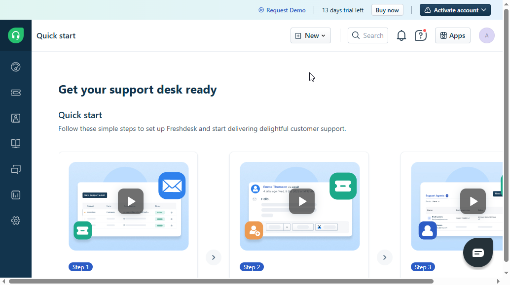

# Freshdesk Setup Guide

Hi! I’m Emmanuel Stefan, and this is my documentation for **Freshdesk**, a cloud-based ticketing system I’ve explored as part of my remote support toolkit. Freshdesk helps manage, prioritize, and resolve support tickets efficiently — making it ideal for both small and large teams.

---

## Why Freshdesk?

I chose Freshdesk because:
- It’s easy to set up and use
- It supports email-to-ticket automation
- It allows customization of workflows, SLAs, and canned responses
- It’s widely used in IT helpdesks, customer support teams, and managed service providers (MSPs)

---

## Setting Up a Free Freshdesk Account

1. Visit [https://freshdesk.com](https://freshdesk.com)
2. Click on **Get Started for Free**
3. Fill in your name, email, and company name

4. You’ll receive a unique Freshdesk subdomain (e.g., `yourcompany.freshdesk.com`)
5. Verify your email and log in to the dashboard

---

## Basic Configuration

### 1. Customize Your Portal
- Go to **Admin > Portals**  
- Set your company logo, name, and support email
- Update portal language and time zone

### 2. Set Up Support Email
- By default, Freshdesk assigns an email like `support@yourcompany.freshdesk.com`
- You can forward your own email (e.g., `support@yourdomain.com`) to this address
- Configure SPF and DKIM records for email authentication (optional but recommended)

### 3. Create Ticket Fields
- Go to **Admin > Ticket Fields**
- Add custom fields like “Device Type,” “Urgency Level,” etc., based on your needs

### 4. SLA policy
- Set **SLA policies** for response/resolution times

_ The SLA targets to be met

---

## How I Use It

- I simulate support requests by emailing the Freshdesk address or using the customer portal
- I track ticket progress with notes and status updates
- I assign priority levels based on urgency and type
- I experiment with auto-assign rules and escalations to mimic real-world support environments

---

## Key Features Explored

- Ticket auto-assignment  
- Email-to-ticket conversion  
- Knowledge base & FAQs  
- Customer satisfaction ratings  
- Agent performance reports  
- Mobile app for support on the go

---

## Screenshots & Use Case Demos

> [Include screenshots or screen recordings here if available]

---

## Final Thoughts

Freshdesk is a powerful and intuitive tool for ticket management. It’s helped me understand the core structure of support workflows and how to manage requests in a professional environment. I’ll continue comparing it with other tools like Jira Service Management and ServiceNow as I deepen my IT support skills.

