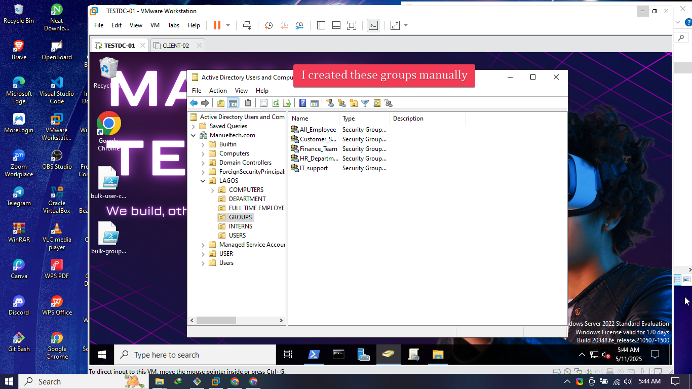
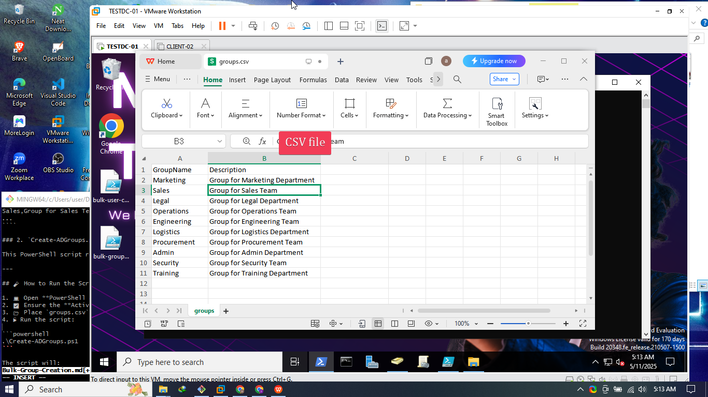

# 📁 Active Directory Group Creation via PowerShell

## 📝 Overview

This guide documents the process I followed to create 10 new Active Directory (AD) groups using PowerShell and a CSV file.

The new groups are created under:

📂 **Organizational Unit (OU) Path:**  
`OU=DEPARTMENT,OU=LAGOS,DC=manueltech,DC=com`

---

## ✅ Existing Groups

These groups were already in place(They were manually created):

- 🖥️ IT Support  
- 🧑‍💼 HR  
- 💰 Finance  
- 📞 Customer Service


---

## ➕ New Groups to be Created

The following groups will be added:

- 📢 Marketing  
- 💼 Sales  
- ⚖️  Legal  
- 🔧 Operations  
- 🛠️ Engineering  
- 🚚 Logistics  
- 🛒 Procurement  
- 🏢 Admin  
- 🛡️ Security  
- 🎓 Training  

---

## 📄 Files Used

### 1. `groups.csv`

Contains group names and descriptions:

```csv
GroupName,Description
Marketing,Group for Marketing Department
Sales,Group for Sales Team
```


### 2. Powershell Script

This PowerShell script reads from the CSV and creates groups in AD.

````
Import-Module ActiveDirectory

$OUPath = "OU=DEPARTMENT,OU=LAGOS,DC=manueltech,DC=com"

$groups = Import-Csv -Path "C:\Users\Administrator\Documents\New-groups\groups.csv"

foreach ($group in $groups) {
    $groupName = $group.GroupName
    $description = $group.Description

    # Check if group already exists
    if (-not (Get-ADGroup -Filter { Name -eq $groupName } -SearchBase $OUPath -ErrorAction SilentlyContinue)) {
        # Create group
        New-ADGroup -Name $groupName `
                    -GroupScope Global `
                    -GroupCategory Security `
                    -Path $OUPath `
                    -Description $description

        Write-Output "Group '$groupName' created successfully."
    } else {
        Write-Output "Group '$groupName' already exists. Skipping..."
    }
}

````


---

## 🧪 How to Run the Script

1. 💻 Open **PowerShell as Administrator**
2. ✅ Ensure the **ActiveDirectory module** is installed
3. ▶️ Run the script:

```powershell

.\bulk-group-creation.ps1

```

The script will:

* Read each group name and description
* Check if it already exists
* Create it if it does not


---

## 🔍 Verifying Group Creation

After the script runs, verify the new groups with:

```powershell
Get-ADGroup -Filter * -SearchBase "OU=DEPARTMENT,OU=LAGOS,DC=manueltech,DC=com" | Select Name
```

✅ Confirm that all 10 new groups appear in the list.


---

## ⚙️ Technical Notes

* Groups are created as: **Global Security Groups**
* Duplicate group creation is avoided
* Script is idempotent: safe to run multiple times

---

## 🛡️ Best Practices

* Always test in a staging environment first
* Review naming conventions with your AD policies
* Set permissions or delegate control per group as needed

