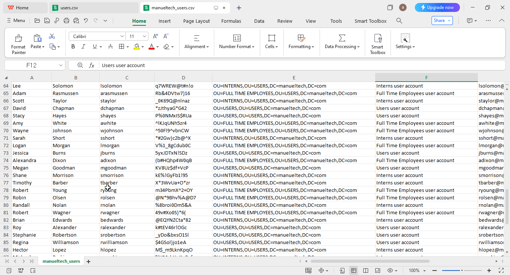
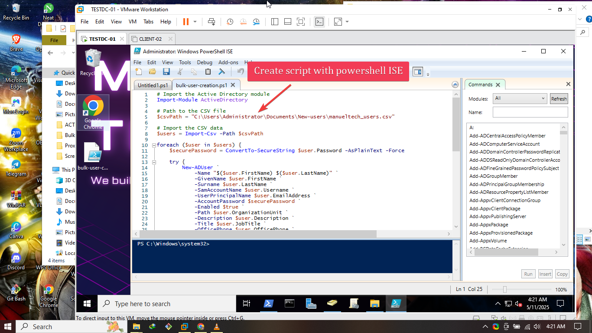
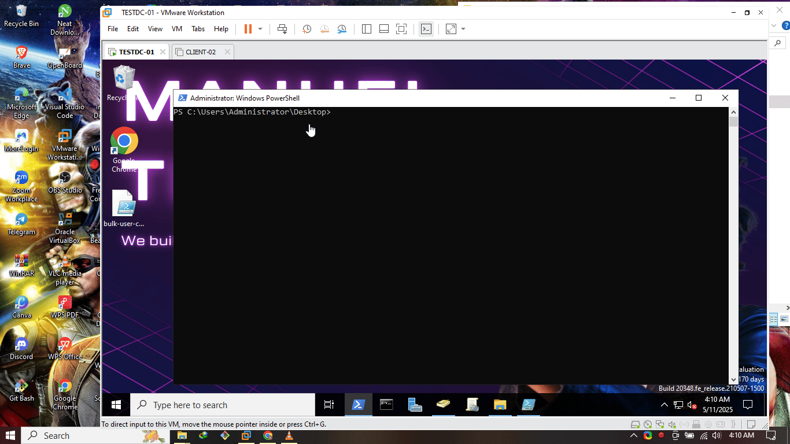
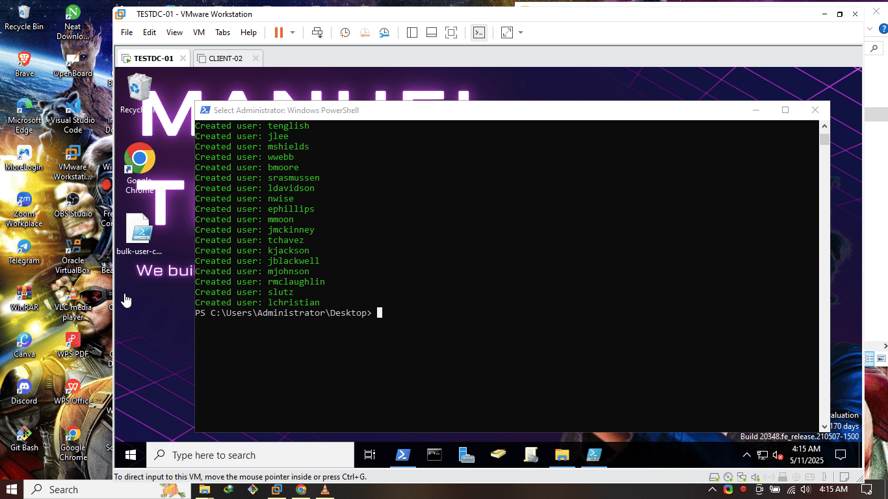

# 👥 Bulk User Account Creation with PowerShell in Active Directory 🖥️

Hey! I'm Emmanuel Stefan 👋 — and this project is part of my Active Directory automation practice using **PowerShell**.  

In this script, I automate the **creation of 100 user accounts** in a Windows Server Active Directory environment.  
This is super useful for onboarding employees or students in bulk without doing it manually in ADUC. 🔄📋

---

## 🧰 What I used for my bulk user creation

- ✅ A Windows Server 2022 with **Active Directory Domain Services** installed
- ✅ **PowerShell** with AD module (`Import-Module ActiveDirectory`)
- ✅ A **CSV file** with 100 user data
- ✅ Appropriate permissions to create users in AD

---

## 📄 CSV Format (users.csv)

I created my CSV file with the following details:

```csv
FirstName	LastName	Username	Password	OrganizationUnit	Description	EmailAddress	JobTitle	OfficePhone	Enabled

Amanda	Bradley	abradley	OTu4E@zQXm)$	OU=FULL TIME EMPLOYEES,OU=LAGOS,DC=manueltech,DC=com	Full Time Employees user account	abradley@manueltech.com	Tree surgeon	9864652518	FALSE
```


---

## 💻 PowerShell Script

```powershell
# Import the Active Directory module
Import-Module ActiveDirectory

# Path to the CSV file
$csvPath = "C:\Users\Administrator\Documents\New-users\manueltech_users.csv"

# Import the CSV data
$users = Import-Csv -Path $csvPath

foreach ($user in $users) {
    $securePassword = ConvertTo-SecureString $user.Password -AsPlainText -Force

    try {
        New-ADUser `
            -Name "$($user.FirstName) $($user.LastName)" `
            -GivenName $user.FirstName `
            -Surname $user.LastName `
            -SamAccountName $user.Username `
            -UserPrincipalName $user.EmailAddress `
            -AccountPassword $securePassword `
            -Enabled $true `
            -Path $user.OrganizationUnit `
            -Description $user.Description `
            -Title $user.JobTitle `
            -OfficePhone $user.OfficePhone `
            -EmailAddress $user.EmailAddress `
            -ChangePasswordAtLogon 1 

        Write-Host "Created user: $($user.Username)" -ForegroundColor Green
    } catch {
        Write-Host "Failed to create user: $($user.Username). Error: $_" -ForegroundColor Red
    }
}


```

---

## 🚀 Running the Script

1. I Opened **PowerShell as Administrator**
2. Typed:

```powershell
Set-ExecutionPolicy RemoteSigned
.\bulk-user-creation.ps1
```

3. Pressed enter and Watched the magic happen! 😁👌🎩✨


---

## Confirm the new users in the domain




## 📁 Files Included

* `bulk-user-creation.ps1` – PowerShell script
* `manueltech_users.csv` –The CSV file I created
* `md file` – You’re reading it 😉

---

## 🔐 Security Tip

Avoid hardcoding passwords in production.
Instead, consider using secure vaults or prompting for passwords interactively 🔒

---

## 🔄 What I Learned

* Automating repetitive AD tasks saves massive time ⏱️
* CSV parsing and scripting logic with loops in PowerShell
* Understanding AD user properties and OU structure
* How to prevent human error in bulk account creation

