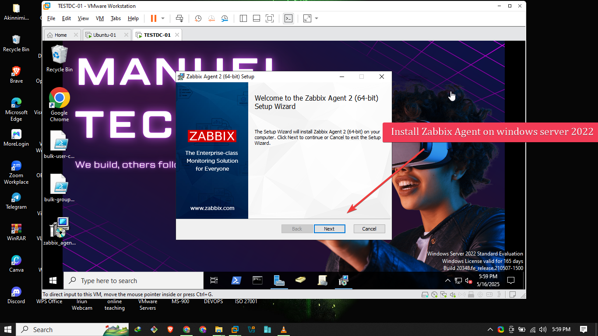

# 🖥️ Zabbix Monitoring Project (Ubuntu Server + Windows Host) - Zabbix 7.2

Hello! 👋 I'm Emmanuel, and this is my Zabbix monitoring project where I set up **Zabbix Server 7.2 on Ubuntu 24.04**, connected it to a **Windows Server 2022 machine** running the Zabbix Agent, and configured **email alerts for critical issues**.

This lab helped me understand service monitoring, trigger configuration, and real-time metric collection — all without requiring physical network hardware.

---

## 🚀 What I Used

- ✅ Ubuntu 24.04 on VMware (Zabbix Server)
- ✅ Windows Server 2022 on VirtualBox (Zabbix Agent)
- ✅ Zabbix 7.2
- ✅ PostgreSQL as the database
- ✅ Email notifications via Zabbix trigger actions

---

## ⚙️ Installing Zabbix Server 7.2 on Ubuntu 24.04

### 🔹 Step 1: Add Zabbix Repository

```bash
wget https://repo.zabbix.com/zabbix/7.2/ubuntu/pool/main/z/zabbix-release/zabbix-release_7.2-1+ubuntu24.04_all.deb
sudo dpkg -i zabbix-release_7.2-1+ubuntu24.04_all.deb
sudo apt update
````

### 🔹 Step 2: Install Server + Frontend + Agent

```bash
sudo apt install zabbix-server-pgsql zabbix-frontend-php php-pgsql zabbix-apache-conf zabbix-sql-scripts zabbix-agent postgresql
```

### 🔹 Step 3: Configure PostgreSQL

```bash
sudo -u postgres createuser --pwprompt zabbix
sudo -u postgres createdb -O zabbix zabbix
```

### 🔹 Step 4: Import Zabbix Schema

```bash
zcat /usr/share/zabbix-sql-scripts/postgresql/server.sql.gz | sudo -u zabbix psql zabbix
```

### 🔹 Step 5: Configure Zabbix Server DB Connection

Edit `/etc/zabbix/zabbix_server.conf`:

```ini
DBPassword= mypassword
```

### 🔹 Step 6: Start Zabbix and Apache

```bash
sudo systemctl restart zabbix-server zabbix-agent apache2
sudo systemctl enable zabbix-server zabbix-agent apache2
```

---

## 🌐 Accessing Zabbix Web Interface (7.2)

* I Opened my browser: `http://192.168.255.137/zabbix`


* Login with default:

  * **Username:** `Admin`
  * **Password:** `zabbix`
  
* Follow the initial setup wizard:


  * Set timezone
  
  * Enter DB connection details
  * Finalize setup and change admin password
  
  

🎉 Now I got access to the Zabbix 7.2 dashboard!


---

## 🧠 Installing Zabbix Agent on Windows Server 2022

### 🔹 Step 1: Download Zabbix Agent

* Visited: [https://www.zabbix.com/download\agents](https://www.zabbix.com/download_agents)
* Select version 7.2 for Windows and download the `.msi`


### 🔹 Step 2: Install and Configure

* Set `Server` and `ServerActive` to your Zabbix server's IP
* Set `Hostname` to match what you'll enter in the Zabbix dashboard

* Allow the agent thorugh windows firewall


### 🔹 Step 3: Start the Agent

* Start the **Zabbix Agent** service from Windows Services

---

## 🖥️ Adding the Windows Host in Zabbix

1. I went to **Configuration → Hosts → Create host**
2. Set:

   * Hostname: Same as in Windows agent config
   * IP: Windows server IP: 192.168.255.210
   
3. Under **Templates**, I linked:

   * `Windows by Zabbix agent`

4. Click **Add**

✅ Metrics will start appearing shortly under **Monitoring → Hosts**


---

## 📧 Setting Up Email Notifications

### 🔹 Step 1: Configure Email Media Type

1. Go to **Administration → Media types**
2. Edit `Email`
3. Use your SMTP info (e.g., Gmail):

   * SMTP server: `smtp.gmail.com`
   * Port: `587`
   * SMTP helo: `localhost`
   * Email: `your-email@gmail.com`
   * Authentication: Username + App Password

### 🔹 Step 2: Add Media to User

1. Go to **Administration → Users**
2. Edit `Admin` → Media
3. Add your email and test sending

### 🔹 Step 3: Create Trigger Action

1. Clicked **Configuration → Actions**
2. Created an action:

   * Name: `Report problems to zabbix administrators`
   * Condition: Trigger severity is greater than or equals average
   * Operation: Send email to Admin


📬 I now get alert emails for any trigger breach!

---

## 📈 Monitoring in Action

* I now get **live metrics** from Windows Server:

  * CPU, Memory, Disk
  * Service states (W32Time, DNS, etc.)
  * Event log messages (errors, warnings)
* Email notifications trigger instantly for problems
* Service discovery works via LLD (low-level discovery)

---

## 🧠 Lessons Learned

* Zabbix 7.2 is incredibly powerful and modular
* Monitoring doesn't require real hardware
* PostgreSQL is fast and stable with Zabbix
* Email alerts make it feel like enterprise-level monitoring

---

## 📎 Future Goals

* Use Slack or Telegram for notifications
* Monitor HTTP endpoints and web apps
* Set up auto-registration for agents
