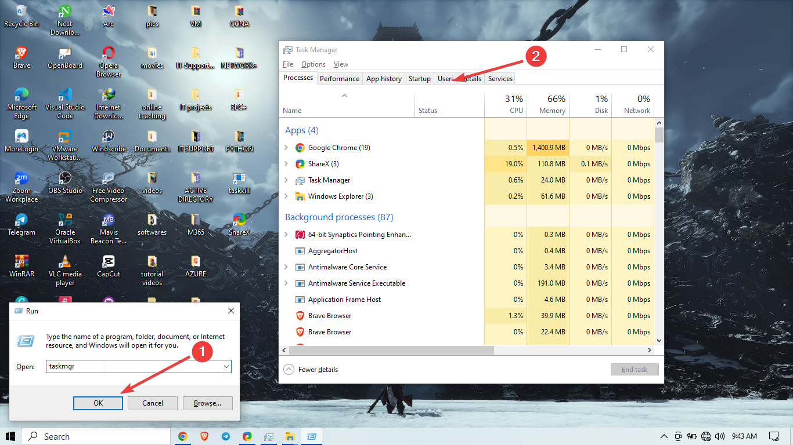
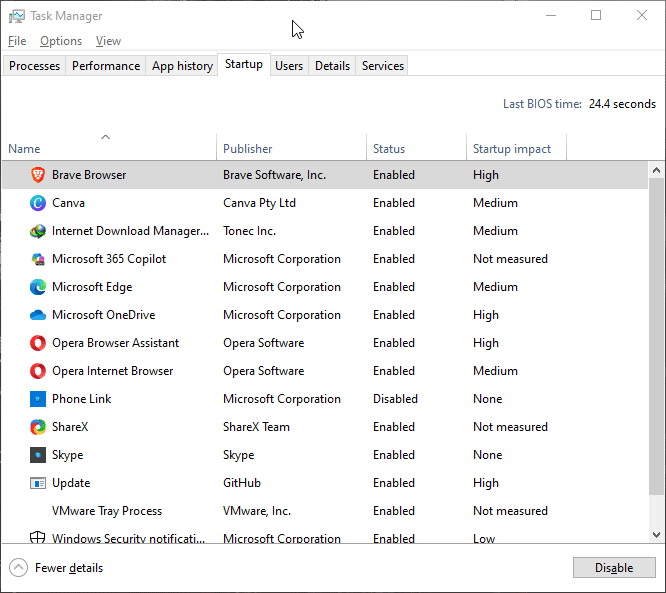

# 🖥️ Slow Performance and Start-Up Issues (Troubleshooting Log)

This document is a walkthrough of how I handled common IT support cases related to **slow system performance** and **delayed start-up times**. These are frequent issues I’ve encountered while supporting end users both remotely and on-site.

## 📝 Issue Overview

I was approached by users who reported that their computers were:

- Taking too long to boot (up to 10 minutes or more).
- Lagging during basic operations like opening files or launching browsers.
- Freezing intermittently, especially when multitasking.
- Displaying high CPU or memory usage for unknown reasons.

---

## 🔎 My Troubleshooting Process

### 1. User Interview & Initial Checks
I started by asking the affected users a few key questions:
- When did the issue start?
- Did they install any new software or updates recently?
- How long does it typically take to boot up?

Then I accessed **Task Manager** to monitor:
- CPU, Memory, and Disk usage while idle.
- Any suspicious background processes.
- Impact of startup programs.

### 2. Startup Optimization
To improve boot time and general responsiveness, I:
- Disabled unnecessary startup programs via `Task Manager > Startup`.

- Ran `msconfig` and disabled non-Microsoft services under the **Services** tab (after hiding all Microsoft entries).
- Removed redundant scheduled tasks.

### 3. Disk Cleanup & System Maintenance
I performed the following steps to free up system resources:
- Ran **Disk Cleanup** and deleted temp files.
- Cleared browser caches.
- Emptied recycle bin.
- Uninstalled unused applications.
- Defragmented HDD (for non-SSD machines).

### 4. Malware and Resource Hog Checks
I scanned the system using:
- **Windows Defender** (Quick + Full Scan).
- **Malwarebytes** for PUPs and adware.
- Checked for any unknown or resource-heavy third-party apps.

### 5. Driver & Windows Updates
I ensured the system was up-to-date by:
- Running `Windows Update`.
- Updating outdated drivers, especially display and storage drivers via **Device Manager** or OEM tools (e.g., HP Support Assistant, Dell Command Update).

### 6. Advanced Steps (If Needed)
For persistent cases, I:
- Used **Sysinternals Autoruns** to identify hidden startup items.
- Monitored system boot time using **Event Viewer** (`Event ID 100` under Diagnostics-Performance).
- Suggested hardware upgrades if RAM or HDD limitations were obvious (e.g., upgrading to SSD or adding more RAM).

---

## ✅ Outcome

In most cases, performance improved significantly after completing the above steps. Start-up time dropped from 10+ minutes to under 2 minutes, and users reported smoother operation overall.

---

## 📁 Tools & Commands Used
- `msconfig`
- `Task Manager`
- `Disk Cleanup`
- `Malwarebytes`
- `Device Manager`
- `Event Viewer`
- `Autoruns` (Sysinternals)

---

## 📌 Notes

- Always check for underlying hardware limits.
- For older systems, SSD upgrades offer the most noticeable performance boost.
- Disabling too many services at once can cause system instability—document every change for easy rollback.
