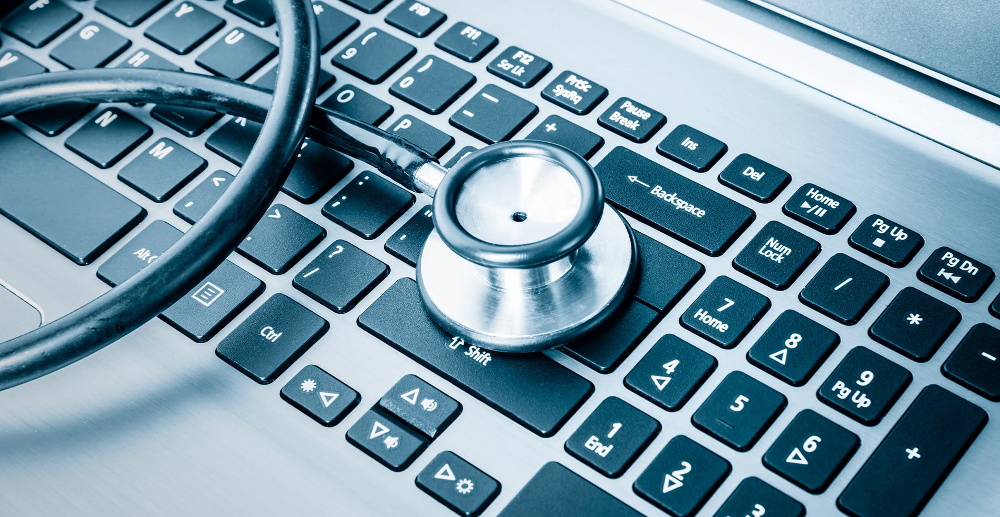

# **Troubleshooting**  

_I Am documenting my hands-on experience diagnosing and resolving hardware and software related issues in Linux and Windows._  

## **📌 About This Section**  
This section contains my practical experience troubleshooting common hardware and siftware issues in IT support. It covers diagnosing CPU and RAM performance problems, fixing disk errors, resolving driver issues, and ensuring system stability.  

Through this journey, I gained hands-on experience with:  

📁 **[WIFI and connectivity issues](Troubleshooting/WIFI-issues)** 

📁 **[Performance and Start-up issues](Troubleshooting/Perfromance-Isuues&Start-up)**

## **🏠 Home Lab Setup**  
To solidify my learning, I tested hardware troubleshooting in different environments:  
✔ **Built and repaired multiple PC systems**  
✔ **Configured Linux and Windows drivers manually**  
✔ **Tested storage solutions for data recovery**  
✔ **Simulated hardware failures to practice troubleshooting**  

## **📌 Key Takeaways from My Learning Experience**  
✅ **Developed hands-on troubleshooting skills for various hardware issues**  
✅ **Learned to diagnose CPU and RAM bottlenecks effectively**  
✅ **Fixed storage-related errors and optimized disk performance**  
✅ **Gained experience in resolving driver compatibility problems**  
