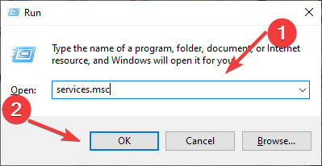

# 🛠️ Troubleshooting Wi-Fi Connection Issues – IT Support Portfolio

## 👋 Introduction

As part of my hands-on experience in IT Support, I worked on resolving a Wi-Fi connectivity issue reported on a Windows laptop. The user was able to connect to the wireless network, but its showing No internet :frowning_face:. Below is a detailed documentation of how I approached and resolved the issue.

---

## 🧩 Issue Summary

- Laptop connected to a WIFI network but showing no internet :worried:. 
- Other nearby devices could connect to the same Wi-Fi without issues.


---

## 🔧 My Troubleshooting Steps

### ✅ 1. Checked Proxy Settings and DNS Configuration
- I Opened `Internet Options` from Control Panel.

- Went to the **Connections** tab → **LAN Settings**.

- Ensured **"Use a proxy server..."** was unchecked.

---

### ⚙️ 2. Verified IPv4 Settings
- I Went to **Control Panel** → **Network and Sharing Center** → **Change Adapter Settings**.

- Right-clicked on the active Wi-Fi adapter and selected **Properties**.

- Double-clicked **Internet Protocol Version 4 (TCP/IPv4)**.
- Ensured **Obtain an IP address automatically** and **Obtain DNS server address automatically** were selected.


---

### 🧰 3. Used the Built-in Network Troubleshooter
- Navigated to **Settings** → **Network & Internet** → **Status**.
- Clicked on **Network Troubleshooter**.

- Followed the on-screen steps to identify and apply basic fixes.


- Searching for problems

- Possible solution to the problem and applying fixes


- Restarting the system after fixing the issue

- Problem fixed


---

### 🔄 4. Performed a Full Network Reset
- I Went to **Settings** → **Network & Internet** → **Advanced network settings**.

- Selected **Network Reset**.


- Restarted the system as prompted.

---

### 💻 5. Ran Key Network Commands via CMD
Opened **Command Prompt as Administrator** and ran:

```bash
netsh winsock reset
netsh int ip reset
ipconfig /release
ipconfig /renew
ipconfig /flushdns
```


- Restarted the system again to apply changes.

---

### 📡 6. Updated the Wi-Fi Adapter Driver
- Opened **Device Manager** → **Network Adapters**.


- Right-clicked the Wi-Fi adapter → **Update Driver** (checked both auto and manual).


- Installing the driver


- Driver successfully installed


### 📡 7. Uninstalled the Wi-Fi Adapter Driver

- Eventually uninstalled the adapter and restarted the system to force a clean reinstall.


---

### 🔍 8. Used `services.msc` to Restart Critical Network Services
- Pressed `Win + R`, typed `services.msc`, and hit Enter.


- Located and ensured the following services were **running** and set to **Automatic**:
  - **WLAN AutoConfig**
  - **Network Connections**
  
  - **Wi-Fi Direct Services Connection Manager**
  
  

- Restarted any that were stopped.

---

## ✅ Outcome

After restarting the Wi-Fi services and reinstalling the driver, the laptop successfully connected to the Wi-Fi network. Internet access was fully restored and stable. I also educated the user on how to check these settings in case the issue reoccurs.
- It worked :smile: :grin:


---

## 🧰 Tools & Utilities Used

- `Command Prompt (Admin)`
- `Device Manager`
- `Services.msc`
- `Network Troubleshooter`
- `Windows Settings` and `Control Panel`

---

## ✍️ Personal Reflection

This experience helped me strengthen my practical troubleshooting workflow and reinforced how crucial it is to approach network issues methodically. From checking proxy settings to verifying services, each step built up to a successful resolution.
---
